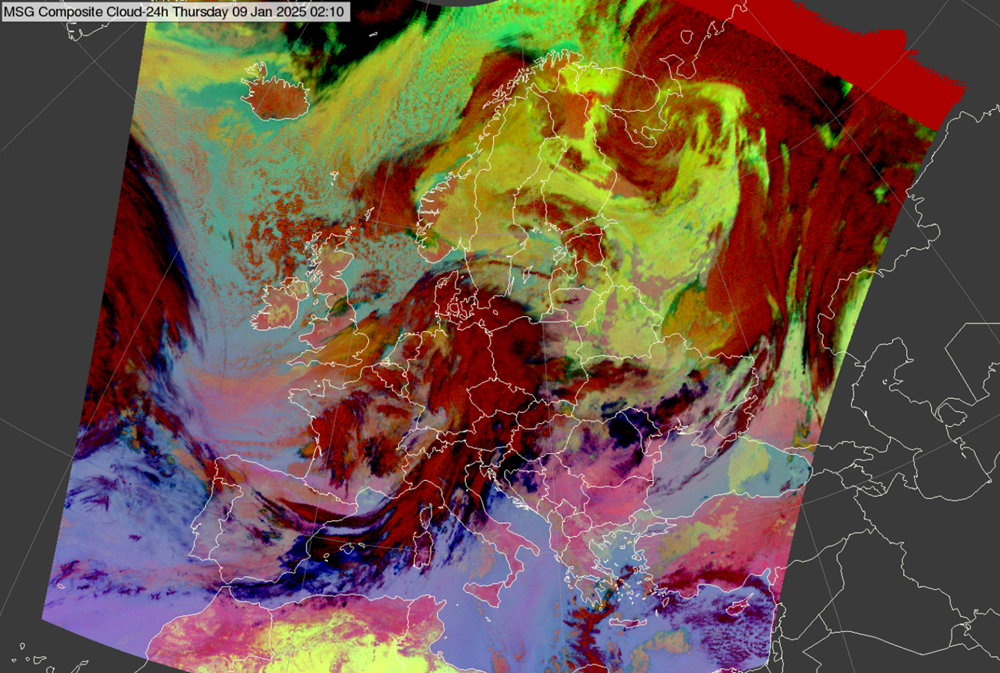

# 24-hour Microphysics Cloud RGB

Alternative name: *24-hour Microphysics RGB*

## Main applications

- 24-hour cloud analyses, including detection of low-level clouds.
- 24-hour moisture boundary detection in cloud-free areas.
- 24-hour cloud phase identification.

## Remarks

- This RGB uses the same channel (differences) as the *24-hour Microphysics Dust RGB*, but with different tuning. It was originally optimized for Central Europe to enhance low cloud detection, whereas the *Dust RGB* is tuned for dust detection and may not detect low clouds.
- The 24-hour Microphysics Cloud RGB performs well in twilight conditions and in very cold environments.
- In regions where this RGB does not perform optimally, the *Dust RGB* could be used instead, particularly due to its effectiveness in detecting moisture boundaries in cloud-free conditions.
- When using FCI data, the BTD (IR10.5 -- IR8.7) may provide less reliable cloud phase differentiation compared to SEVIRI, due to slight differences between the IR10.8 and IR10.5 channels.

## RGB Recipes by Satellite Instrument

### MSG SEVIRI 24-hour Microphysics Cloud RGB

| Colour beam | Channel (difference) | Range min | Range max | Unit | Gamma |
|-------------|----------------------|-----------|-----------|------|-------|
| Red         | IR12.0 -- IR10.8     | -4        | +2        | K    | 1.0   |
| Green       | IR10.8 -- IR8.7      | 0         | +6        | K    | 1.2   |
| Blue        | IR10.8               | 248       | 303       | K    | 1.0   |

### MTG FCI 24-hour Microphysics Cloud RGB

| Colour beam | Channel (difference) | Range min | Range max | Unit | Gamma |
|-------------|----------------------|-----------|-----------|------|-------|
| Red         | IR12.3 -- IR10.5     | -7.1      | +2.4      | K    | 1.0   |
| Green       | IR10.5 -- IR8.7      | 0.2       | 5.2       | K    | 1.2   |
| Blue        | IR10.5               | 247.8     | 303.1     | K    | 1.0   |

### Himawari AHI 24-hour Microphysics Cloud RGB

| Colour beam | Channel (difference) | Range min | Range max | Unit | Gamma |
|-------------|----------------------|-----------|-----------|------|-------|
| Red         | IR12.4 -- IR10.4     | -7.5      | +3        | K    | 1.0   |
| Green       | IR11.2 -- IR8.6      | -0.4      | +6.1      | K    | 1.1   |
| Blue        | IR10.4               | 248.6     | 303.2     | K    | 1.0   |

### FY-4 AGRI 24-hour Microphysics Cloud RGB

| Colour beam | Channel (difference) | Range min | Range max | Unit | Gamma |
|-------------|----------------------|-----------|-----------|------|-------|
| Red         | IR12.0 -- IR10.8     | -4        | +2.0      | K    | 1.0   |
| Green       | IR10.8 -- IR8.55     | 0         | 6.0       | K    | 1.2   |
| Blue        | IR10.8               | 248       | 303       | K    | 1.0   |

### GOES ABI 24-hour Microphysics Cloud RGB

| Colour beam | Channel (difference) | Range min | Range max | Unit | Gamma |
|-------------|----------------------|-----------|-----------|------|-------|
| Red         | IR12.3 -- IR10.5     | -7.1      | +2.4      | K    | 1.0   |
| Green       | IR11.2 -- IR8.4      | 0.2       | 5.2       | K    | 1.2   |
| Blue        | IR10.3               | 247.8     | 303.1     | K    | 1.0   |
