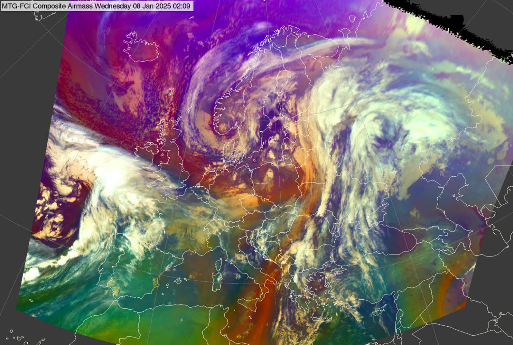

# Airmass RGB

## Main application

- 24-hour monitoring of atmospheric dynamics (e.g., jet streams and upper-level features).

## Remark

- A variant of the Airmass RGB with modified tuning for tropical regions is available under Special Applications RGB (see: *Overshooting Tops RGB*).

## RGB Recipes by Satellite Instrument

### MSG SEVIRI Airmass RGB

| Colour beam | Channel (difference) | Range min | Range max | Unit | Gamma |
|-------------|----------------------|-----------|-----------|------|-------|
| Red         | WV6.2 -- WV7.3       | -25       | 0         | K    | 1.0   |
| Green       | IR9.7 -- IR10.8      | -40       | +5        | K    | 1.0   |
| Blue        | WV6.2                | 243       | 208       | K    | 1.0   |

### MTG FCI Airmass RGB

| Colour beam | Channel (difference) | Range min | Range max | Unit | Gamma |
|-------------|----------------------|-----------|-----------|------|-------|
| Red         | WV6.3 -- WV7.3       | -23.8     | +1.4      | K    | 1.0   |
| Green       | IR9.7 -- IR10.5      | -39.7     | +4.1      | K    | 1.0   |
| Blue        | WV6.3                | 244.5     | 209.4     | K    | 1.0   |

### GOES ABI Airmass RGB

| Colour beam | Channel (difference) | Range min | Range max | Unit | Gamma |
|-------------|----------------------|-----------|-----------|------|-------|
| Red         | WV6.2 -- WV7.3       | -26.2     | +0.6      | K    | 1.0   |
| Green       | IR9.6 -- IR10.3      | -43.2     | +6.7      | K    | 1.0   |
| Blue        | WV6.2                | 243.9     | 208.5     | K    | 1.0   |

### Himawari AHI Airmass RGB

| Colour beam | Channel (difference) | Range min | Range max | Unit | Gamma |
|-------------|----------------------|-----------|-----------|------|-------|
| Red         | WV6.2 -- WV7.3       | -25.8     | 0         | K    | 1.0   |
| Green       | IR9.6 -- IR10.4      | -41.5     | +4.3      | K    | 1.0   |
| Blue        | WV6.2                | 242.6     | 208.0     | K    | 1.0   |
