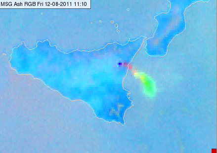

# 24-hour Microphysics Ash RGB

Alternative name: *Ash RGB*

## Main applications

-   24-hour detection of volcanic ash

-   24-hour detection of volcanic sulphur dioxide (SO₂) gas plume

-   Not suitable near the limb (due to geometric distortions)

## Remarks

-   This RGB uses the same channel combinations as the *24-hour
    Microphysics Cloud RGB*, but with different range values applied for
    ash detection.

## RGB Recipes by Satellite Instrument

### MSG SEVIRI Ash RGB

| Colour beam | Channel (difference) | Range min | Range max | Unit | Gamma |
|-------------|----------------------|-----------|-----------|------|-------|
| Red         | IR12.0 -- IR10.8     | -4        | +2        | K    | 1.0   |
| Green       | IR10.8 -- IR8.7      | -4        | +5        | K    | 1.0   |
| Blue        | IR10.8               | 243       | 303       | K    | 1.0   |

### MTG FCI Ash RGB

| Colour beam | Channel (difference) | Range min | Range max | Unit | Gamma |
|-------------|----------------------|-----------|-----------|------|-------|
| Red         | IR12.0 -- IR10.8     | -7.1      | +2.4      | K    | 1.0   |
| Green       | IR10.8 -- IR8.7      | -3.2      | +4.4      | K    | 1.0   |
| Blue        | IR10.8               | 242.8     | 303.1     | K    | 1.0   |

### GOES ABI Ash RGB

| Colour beam | Channel (difference) | Range min | Range max | Unit | Gamma |
|-------------|----------------------|-----------|-----------|------|-------|
| Red         | IR12.3 -- IR10.3     | -6.7      | +2.6      | K    | 1.0   |
| Green       | IR11.2 -- IR8.4      | -6.0      | +6.3      | K    | 1.0   |
| Blue        | IR10.3               | 243.6     | 302.4     | K    | 1.0   |

### Himawari AHI Ash RGB

| Colour beam | Channel (difference) | Range min | Range max | Unit | Gamma |
|-------------|----------------------|-----------|-----------|------|-------|
| Red         | IR12.4 -- IR10.4     | -7.5      | +3        | K    | 1.0   |
| Green       | IR11.2 -- IR8.6      | -1.6      | +4.9      | K    | 1.2   |
| Blue        | IR10.4               | 243.6     | 303.2     | K    | 1.0   |

### FY-4 AGRI Ash RGB

| Colour beam | Channel (difference) | Range min | Range max | Unit | Gamma |
|-------------|----------------------|-----------|-----------|------|-------|
| Red         | IR12.0 -- IR10.8     | -4        | +6        | K    | 1.0   |
| Green       | IR10.8 -- IR8.55     | -4        | +5        | K    | 1.0   |
| Blue        | IR10.8               | 243       | 303       | K    | 1.0   |
