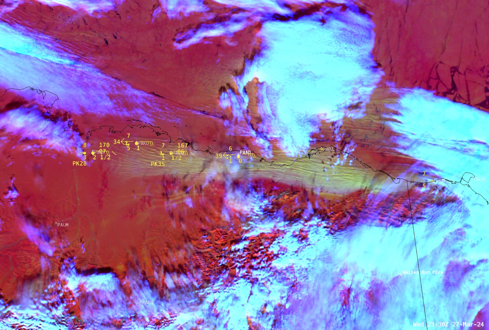

# Day Blowing Snow RGB

Alternative name: *Blowing Snow RGB*

## Main applications

- Detection of blowing snow (also referred to as ground blizzards), where snow is lifted from the surface and transported by strong winds.

## Remarks

- A variation of the *Day Snow-Fog RGB*, specifically tuned to highlight lofted snow.
- Snow on the ground appears in red tones.  
  Lofted/blowing snow appears in pink, orange, or yellow, depending on plume thickness, solar illumination, and viewing geometry.  
  Snow-free land appears green.
- At night, only clouds are visible, typically in blue shades.
- The RGB is sensitive to cloud phase and particle size; however the *Day Cloud Phase RGB* is generally preferred for these applications.
- Current validation is limited to:
  - Northern United States and southern Canada (using ABI)
  - Alaska (using VIIRS).

## ABI Blowing Snow RGB

| Colour beam | Channel (difference) | Range min | Range max | Unit | Gamma |
|-------------|----------------------|-----------|-----------|------|-------|
| Red         | VIS0.64              | 0         | 50        | %    | 0.7   |
| Green       | NIR1.6               | 2         | 20        | %    | 1.0   |
| Blue        | IR3.9 -- IR10.3      | 0         | 30        | K    | 0.7   |

## VIIRS Blowing Snow RGB

| Colour beam | Channel (difference) | Range min | Range max | Unit | Gamma |
|-------------|----------------------|-----------|-----------|------|-------|
| Red         | VIS0.64              | 10        | 110       | %    | 1.0   |
| Green       | NIR1.6               | 5         | 40        | %    | 1.0   |
| Blue        | IR3.9 -- IR10.3      | 0         | 15        | K    | 1.0   |

## Next steps / Recommendations

- Further validation is needed across:
  - addtional satellite sensors
  - different regions where blowing snow is a hazard
- Feedback from operational users is required.
