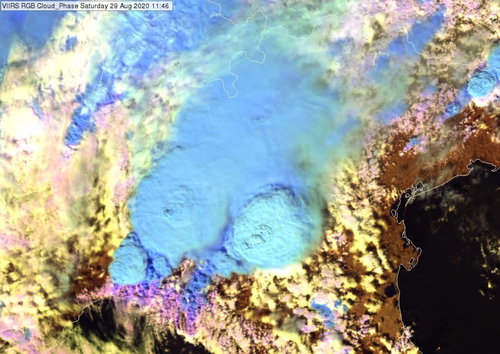

# Day Cloud Phase RGB

Alternative name: *Cloud Phase RGB*

## Main applications (Daytime)

-   Detection of cloud phase (e.g., liquid water, ice, mixed phase)

-   Monitoring of low and high cloud features

-   Analysis of cloud top microphysics, including particle size
    detection

## Remarks

-   This RGB provides enhanced information on cloud top microphysics
    (phase and effective particle size) for optically thick clouds.

-   Colours may become oversaturated at high solar zenith angles (near
    the terminator line).

-   Rayleigh correction for the VIS0.64 channel is generally not
    necessary.

-   For NIR channels, an alternative range of 0-70% reflectance should
    also be tested to assess if it may demonstrate better results.

## RGB Recipes by Satellite Instrument

### MTG FCI Day Cloud Phase RGB

| Colour beam | Channel (difference) | Range min | Range max | Unit | Gamma |
|-------------|----------------------|-----------|-----------|------|-------|
| Red         | NIR1.6               | 0         | 50        | %    | 1.0   |
| Green       | NIR2.3               | 0         | 50        | %    | 1.0   |
| Blue        | VIS0.6               | 0         | 100       | %    | 1.0   |

### Himawari AHI Day Cloud Phase RGB

| Colour beam | Channel (difference) | Range min | Range max | Unit | Gamma |
|-------------|----------------------|-----------|-----------|------|-------|
| Red         | NIR1.6               | 0         | 50        | %    | 1.0   |
| Green       | NIR2.3               | 0         | 50        | %    | 1.0   |
| Blue        | VIS0.64              | 0         | 100       | %    | 1.0   |

### GOES ABI Day Cloud Phase RGB

| Colour beam | Channel (difference) | Range min | Range max | Unit | Gamma |
|-------------|----------------------|-----------|-----------|------|-------|
| Red         | NIR1.6               | 0         | 50        | %    | 1.0   |
| Green       | NIR2.3               | 0         | 50        | %    | 1.0   |
| Blue        | VIS0.64              | 0         | 100       | %    | 1.0   |
