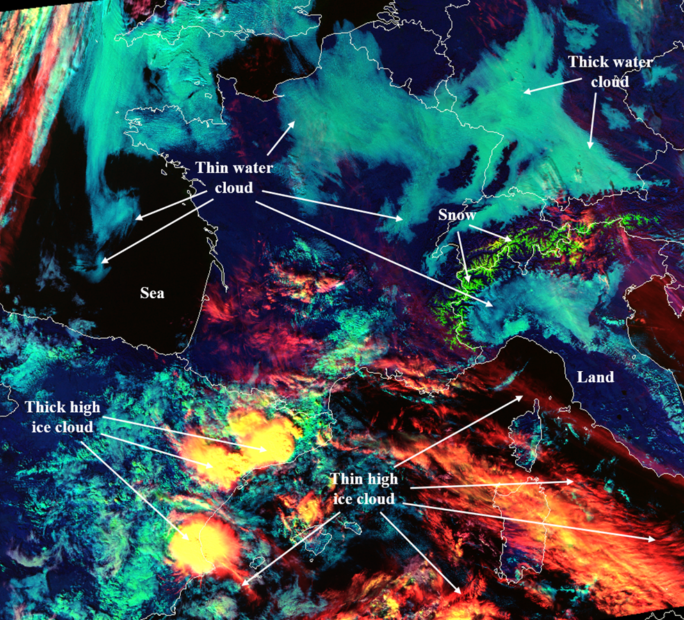
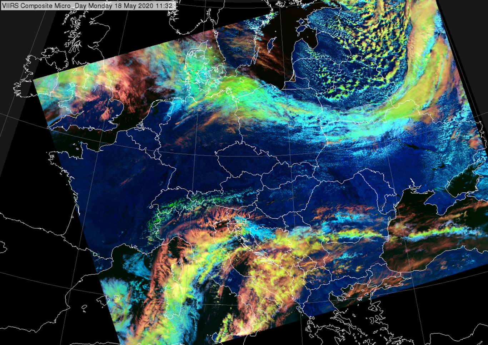

# Day Cloud Type RGB

Alternative name: *Cloud Type RGB*

## Main applications (Daytime)

-   Detection of high-level thin cirrus clouds

-   Detection of high-level thin aerosol plumes

-   Identification of cloud types

-   Indication of dry airmass regions

## Remarks

-   This RGB provides information on cloud height.

-   Similar to *Day Cloud Type Distinction RGB*, which uses IR10.x
    temperature in the red component.

-   The RGB is newly introduced to FCI.

## RGB Recipes by Satellite Instrument

### MTG FCI Day Cloud Type RGB

| Colour beam | Channel          | Range min | Range max | Unit | Gamma |
|-------------|------------------|-----------|-----------|------|-------|
| Red         | NIR1.37          | 0         | 10        | %    | 1.5   |
| Green       | VIS0.64          | 0         | 80        | %    | 0.75  |
| Blue        | NIR1.6           | 0         | 80        | %    | 1     |

### GOES ABI Day Cloud Type RGB

| Colour beam | Channel          | Range min | Range max | Unit | Gamma |
|-------------|------------------|-----------|-----------|------|-------|
| Red         | NIR1.37          | 0         | 10        | %    | 1.5   |
| Green       | VIS0.64          | 0         | 78        | %    | 1     |
| Blue        | NIR1.6           | 0         | 59        | %    | 1     |

## Variant: Day Cloud Type Distinction RGB

Alternative name: *Day Cloud Phase Distinction RGB*

### Main applications (Daytime)

-   General cloud analyses

-   Detection of convective initiation

### Remarks

-   This RGB uses nearly the same channels as the *Day Microphysics
    RGB*, but with a different colour assignment, resulting in a
    distinct appearance---though the underlying information is largely
    similar. The main difference is that the *Day Microphysics RGB*
    includes particle size information via the IR3.8 reflectance in the
    green beam.

    -   *Day Cloud Type Distinction RGB* emphasizes cloud optical
        thickness and temperature.

    -   *Day Microphysics RGB* focuses on cloud top microphysics and
        optical thickness.

-   The name "*Day Cloud Phase Distinction*" is commonly used by some
    forecasters, but can be misleading, as this RGB is more like the
    *Day Cloud Type RGB* and very different from the *Day Cloud Phase
    RGB*. The preferred term is *Day Cloud Type Distinction RGB*.

-   While this RGB resembles the *Cloud Type RGB* in typical colours,
    the interpretation differs in parts, which may be confusing if both
    RGBs are used. Notably, this RGB uses IR10.x in the red beam (from
    ABI and AHI), while the *Cloud Type RGB* uses NIR1.37.

### GOES ABI Day Cloud Phase Distinction RGB

| Colour beam | Channel (difference) | Range min | Range max | Unit | Gamma |
|-------------|----------------------|-----------|-----------|------|-------|
| Red         | IR10.3               | 280.7     | 219.6     | K    | 1.0   |
| Green       | VIS0.64              | 0         | 78        | %    | 1.0   |
| Blue        | NIR1.6               | 1         | 59        | %    | 1.0   |

### Himawari AHI Cloud Phase Distinction RGB

| Colour beam | Channel (difference) | Range min | Range max | Unit | Gamma |
|-------------|----------------------|-----------|-----------|------|-------|
| Red         | IR10.4               | 280.7     | 219.6     | K    | 1.0   |
| Green       | VIS0.64              | 0         | 85        | %    | 1.0   |
| Blue        | NIR1.6               | 1         | 50        | %    | 1.0   |
