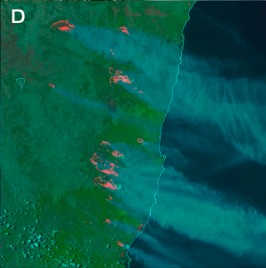

# Day Fire RGB

Alternative names: *Day Land Cloud Fire RGB, Natural Fire Colour RGB*

wildland fires in southeast Australia

This RGB has two commonly used variants, depending on whether the red colour beam uses brightness temperature (IR3.8) or reflectance (IR3.8refl).

## Variant 1: Using IR3.8 (Brightness Temperature)

### Main applications

- Detection of active fires and associated smoke plumes.
- Enhanced visualization of vegetation and burnt areas.

### Remarks

- This RGB does not provide information on fire intensity.
- Sensitive to moderately hot or sub-pixel fires.
- Very hot surfaces may mask fire signals by saturating red channel.

### Day Fire RGB

| Colour beam | Channel (difference) | Range min | Range max | Unit | Gamma |
|-------------|----------------------|-----------|-----------|------|-------|
| Red         | NIR3.8               | 273       | 333*      | K    | 0.4   |
| Green       | NIR0.86              | 0         | 100       | %    | 1.0   |
| Blue        | VIS0.64              | 0         | 100       | %    | 1.0   |

* In hot and arid regions, the upper limit of the red range is recommended to be adjusted to 343 K to avoid saturation under non-fire conditions (as also advised for the *Fire Temperature RGB*).

## Variant 2: Using IR3.8refl (Reflectance)

### Main applications

- Detection of active fires and associated smoke plumes.
- Enhanced visualization of vegetation and burnt areas.

### Remarks

- This RGB does not provide information on fire intensity.
- Sensitive to moderately hot or sub-pixel fires.
- The background appears less red over hot land surfaces compared to Variant 1, making fire detection more distinct.
- Provides improved colour contrast between actively burning and burnt/smouldering pixels compared to Variant 1. However, Variant 1 may still be preferred for precise fire perimeter mapping (*Seaman et al., 2023*).

### Day Fire RGB

| Colour beam | Channel (difference) | Range min | Range max | Unit | Gamma |
|-------------|----------------------|-----------|-----------|------|-------|
| Red         | NIR3.8refl           | 0         | 50        | %    | 1.0   |
| Green       | NIR0.8               | 0         | 100       | %    | 2.0   |
| Blue        | VIS0.6               | 0         | 100       | %    | 2.0   |
