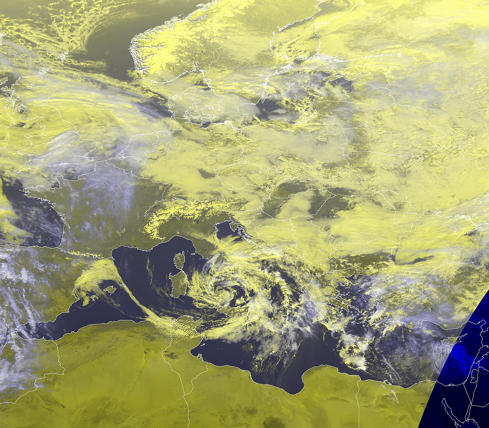
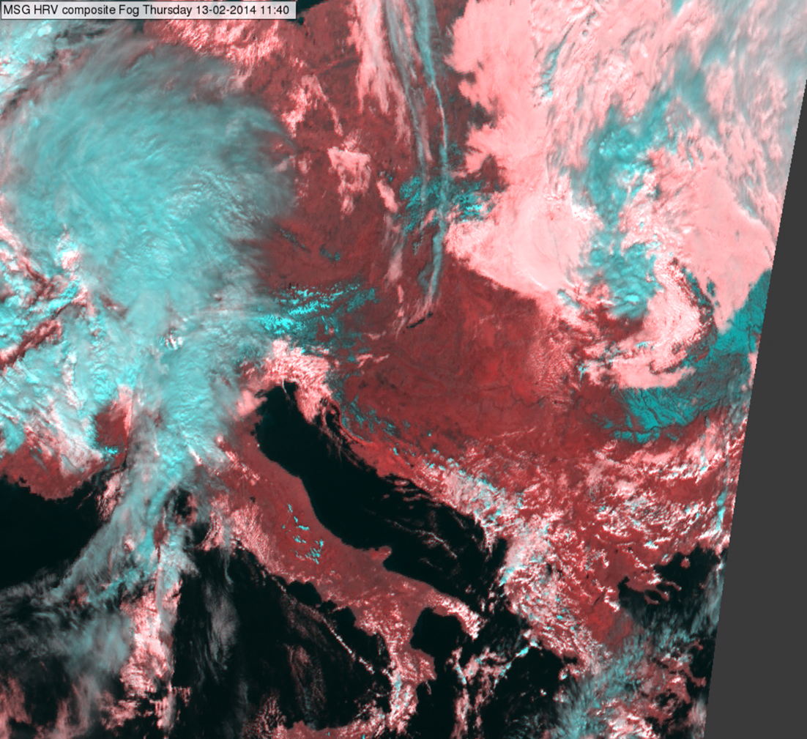
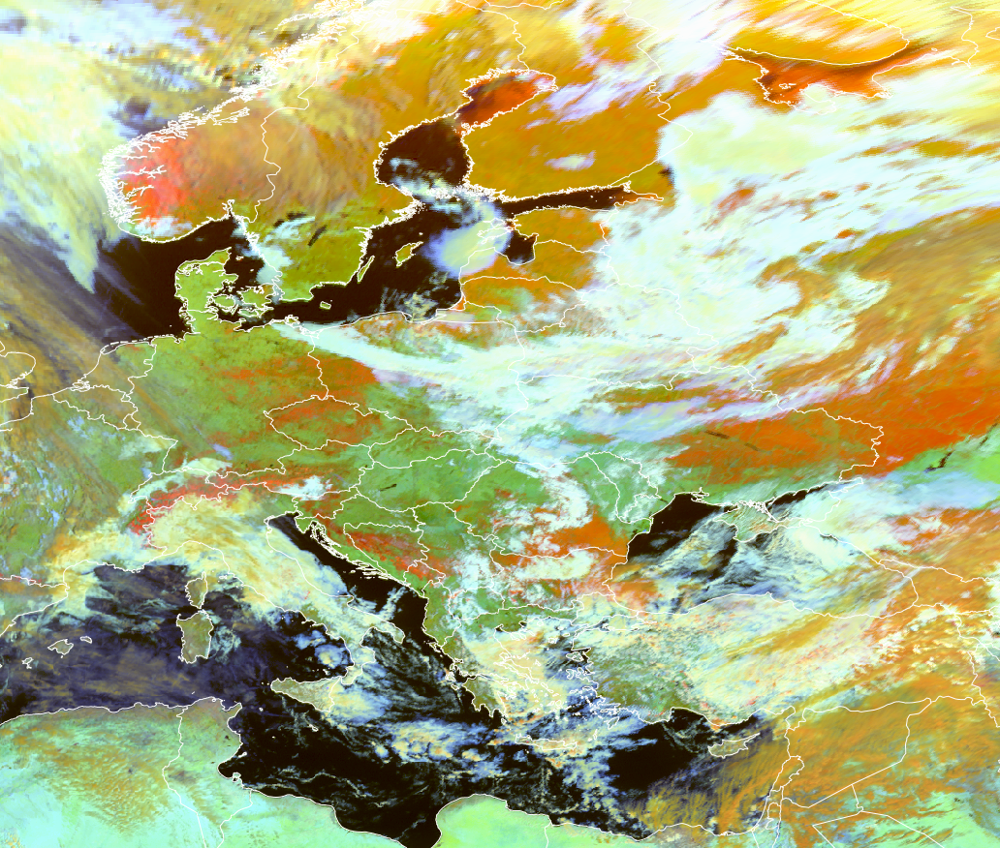

# Day HRV Clouds RGB (Legacy)

## Main application

- Monitoring convection
- Monitoring clouds using high-resolution imagery

## Remarks

- This is a very early RGB type, developed before the availability of multiple high-resolution channels.
- It produces visually appealing, easy-to-interpret images.
- The RGB combines information on cloud optical thickness and cloud top temperature.
- For SEVIRI, the HRV channel was the only high-resolution channel available, which is why it was used in both the red and green colour beams.
- With MTG FCI, all shortwave channels now offer higher resolution than the IR channels, eliminating the need to duplicate the same shortwave channel in two colour beams.
- Day Cloud Convection RGB is a version of this RGB (for any of the newest imagers that have advance resolution for visible channels) with only slightly different tuning.

## SEVIRI Day HRV Clouds RGB

| Colour beam | Channel (difference) | Range min | Range max | Unit | Gamma |
|-------------|----------------------|-----------|-----------|------|-------|
| Red         | HRV                  | 0         | 100       | %    | 1.0   |
| Green       | HRV                  | 0         | 100       | %    | 1.0   |
| Blue        | IR10.8               | 323       | 203       | K    | 1.0   |

## ABI Day Cloud Convection RGB

| Colour beam | Channel (difference) | Range min | Range max | Unit | Gamma |
|-------------|----------------------|-----------|-----------|------|-------|
| Red         | VIS0.64              | 0         | 100       | %    | 1.7   |
| Green       | VIS0.64              | 0         | 100       | %    | 1.7   |
| Blue        | IR10.3               | 323       | 203       | K    | 1.0   |

## HRV Fog RGB (Legacy)

### Main applications

- Monitoring fog/low cloud and snow-covered land in high resolution
- General cloud monitoring, including information on cloud phase and optical thickness

### Remarks

- It produces visually appealing, easy-to-interpret images.
- For SEVIRI, the HRV channel was the only high-resolution channel available, which is why it was used in two colour beams.
- With MTG FCI, shortwave channels have higher resolution than the IR channels, eliminating the need to duplicate the same shortwave channel in two colour beams.
- This RGB has been superseded by more advanced product such as the *Cloud Phase RGB* and *Cloud Type RGB*, which offer improved capabilities for detecting snow and low clouds.

### SEVIRI HRV Fog RGB

| Colour beam | Channel (difference) | Range min | Range max | Unit | Gamma |
|-------------|----------------------|-----------|-----------|------|-------|
| Red         | NIR1.6               | 0         | 70        | %    | 1.0   |
| Green       | HRV                  | 0         | 100       | %    | 1.0   |
| Blue        | HRV                  | 0         | 100       | %    | 1.0   |

## Day Snow-Fog RGB (Legacy)

Alternative name: *Snow RGB*

MSG SEVIRI Snow RGB -- 19 February 2025, 10:30 UTC

### Main applications

- Snow detection
- Differentiation betweem fog/stratus and snow-covered surfaces

### Remarks

- For snow detection, the *Cloud Phase RGB* and *Cloud Type RGB* are also highly effective, Particularly as they use two microphysical NIR channels where snow's reflectance is low.
- For cloud detection, the *Cloud Phase RGB* generally performs better than the *Snow RGB*.

### RGB Recipes by Satellite Instrument

#### MSG SEVIRI Day Snow-Fog RGB

| Colour beam | Channel (difference) | Range min | Range max | Unit | Gamma |
|-------------|----------------------|-----------|-----------|------|-------|
| Red         | VIS0.8               | 0         | 100       | %    | 1.7   |
| Green       | NIR1.6               | 0         | 70        | %    | 1.7   |
| Blue        | IR3.9refl            | 0         | 30        | %    | 1.7   |

#### GOES ABI Day Snow-Fog RGB

| Colour beam | Channel (difference) | Range min | Range max | Unit | Gamma |
|-------------|----------------------|-----------|-----------|------|-------|
| Red         | NIR0.86              | 0         | 100       | %    | 1.7   |
| Green       | NIR1.6               | 0         | 70        | %    | 1.7   |
| Blue        | IR3.9 -- IR10.3      | 0         | 30        | K    | 1.7   |

#### Himawari AHI Day Snow-Fog RGB

| Colour beam | Channel (difference) | Range min | Range max | Unit | Gamma |
|-------------|----------------------|-----------|-----------|------|-------|
| Red         | NIR0.86              | 0         | 102       | %    | 1.6   |
| Green       | NIR1.6               | 0         | 68        | %    | 1.7   |
| Blue        | IR3.9 refl           | 2         | 45        | %    | 1.95  |

#### FY4 AGRI Snow RGB

| Colour beam | Channel (difference) | Range min | Range max | Unit | Gamma |
|-------------|----------------------|-----------|-----------|------|-------|
| Red         | NIR0.825             | 0         | 100       | %    | 1.7   |
| Green       | NIR1.6               | 0         | 60        | %    | 1.7   |
| Blue        | IR3.75 refl          | 0         | 30        | %    | 1.7   |
