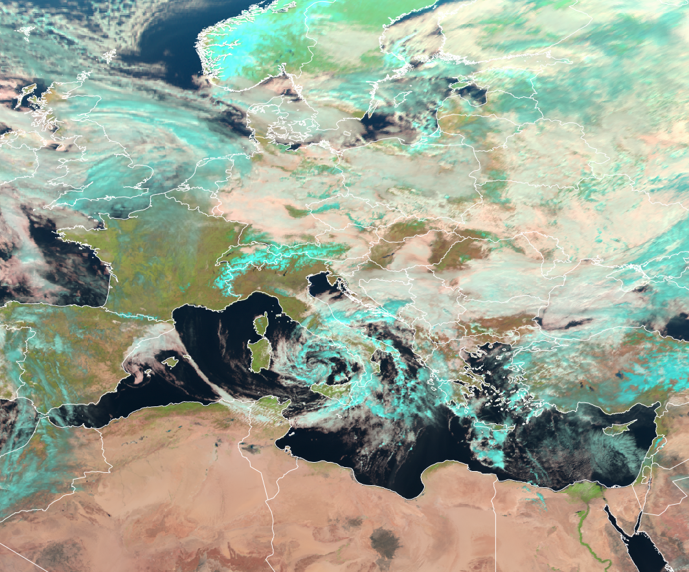
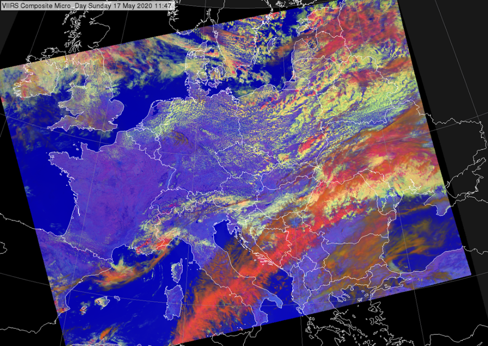

# Day Land Cloud RGB (Legacy)

Alternative name: *Natural Colour RGB*

MSG SEVIRI Day Land Cloud RGB -- 15 February 2025, 11:30 UTC

## Main applications (Daytime)

- Vegetation monitoring
- Cloud phase detection
- Aerosol detection
- Fires (only very intense)
- Flood detection

## Remarks

- This RGB is still outperforms Ture Colour RGB spectrally when it comes to vegetation signal, due to use of very effective VIS0.8 'vegetation channel'.
- Despite the fact that True Colour RGB has a better sensitivity to aerosols, this RGB still outperforms in terms of aerosol classification (in terms of aerosol particle size).

## RGB Recipes by Satellite Instrument

### SEVIRI Day Land Cloud RGB

| Colour beam | Channel (difference) | Range min | Range max | Unit | Gamma |
|-------------|----------------------|-----------|-----------|------|-------|
| Red         | NIR1.6               | 0         | 100       | %    | 1.0   |
| Green       | VIS0.8               | 0         | 100       | %    | 1.0   |
| Blue        | VIS0.6               | 0         | 100       | %    | 1.0   |

### MTG FCI Day Land Cloud RGB

| Colour beam | Channel (difference) | Range min | Range max | Unit | Gamma |
|-------------|----------------------|-----------|-----------|------|-------|
| Red         | NIR1.6               | 0         | 100       | %    | 1.0   |
| Green       | VIS0.8               | 0         | 100       | %    | 1.0   |
| Blue        | VIS0.6               | 0         | 100       | %    | 1.0   |

### GOES ABI Day Land Cloud RGB

| Colour beam | Channel (difference) | Range min | Range max | Unit | Gamma |
|-------------|----------------------|-----------|-----------|------|-------|
| Red         | NIR1.6               | 0         | 97.5      | %    | 1.0   |
| Green       | NIR0.86              | 0         | 108.6     | %    | 1.0   |
| Blue        | VIS0.64              | 0         | 100       | %    | 1.0   |

### Himawari AHI Day Land Cloud RGB

| Colour beam | Channel (difference) | Range min | Range max | Unit | Gamma |
|-------------|----------------------|-----------|-----------|------|-------|
| Red         | NIR1.6               | 0         | 99        | %    | 1.0   |
| Green       | NIR0.86              | 0         | 102       | %    | 0.95  |
| Blue        | VIS0.64              | 0         | 100       | %    | 1.0   |

### FY-4 AGRI Day Land Cloud RGB

| Colour beam | Channel (difference) | Range min | Range max | Unit | Gamma |
|-------------|----------------------|-----------|-----------|------|-------|
| Red         | NIR1.61              | 0         | 100       | %    | 1.0   |
| Green       | VIS0.825             | 0         | 100       | %    | 1.0   |
| Blue        | VIS0.65              | 0         | 100       | %    | 1.0   |

## Day Microphysics RGB (with NIR1.6) (Legacy)

### Main applications (Daytime)

- General cloud analyses
- Monitoring convection
- Monitoring cloud top phase

### Remarks

- This RGB does not require calculation of IR 3.8 µm reflectance (IR3.8refl).
- It performs well overall and behaves similarly to the standard *Day Microphysics RGB*, but lacks particle size sensitivity inherited from reflective component of IR3.8 channel (included in *Day Microphysics RGB*).
- Differentiation between small and large cloud-top droplets (particularly for water clouds) is less effective. Sensitivity to cloud top particle size exists, but within a narrower range than the standard *Day Microphysics RGB*.
- Commonly used with data from Metop AVHRR, VIIRS, and SEVIRI.

*Note*: On some satellites, AVHRR switches between 1.6 µm (day) and 3.7 µm (night). As a result, the standard Day Microphysics RGB (which uses IR3.8) cannot be generated during the day on those platforms (hence the need for this RGB).

### VIIRS Day Microphysics RGB (with NIR1.6)

| Colour beam | Channel (difference) | Range min | Range max | Unit | Gamma |
|-------------|----------------------|-----------|-----------|------|-------|
| Red         | VIS0.8               | 0         | 100       | %    | 1.0   |
| Green       | NIR1.6               | 0         | 70        | %    | 1.0   |
| Blue        | IR10.5               | 203       | 323       | K    | 1.0   |
