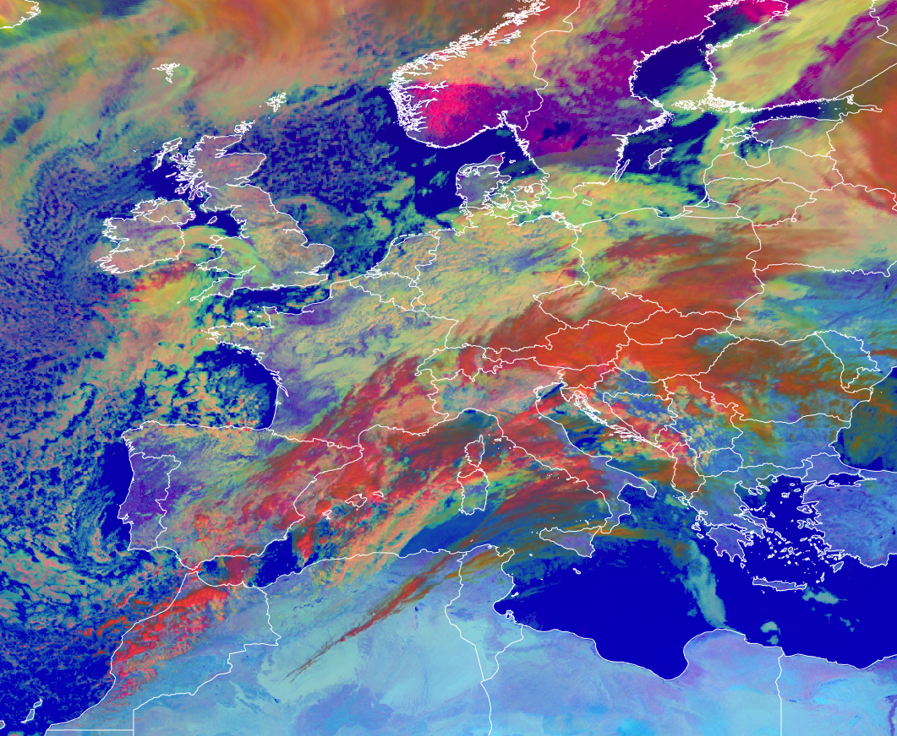

# Day Microphysics RGB

## Main applications (Daytime)

- Cloud analyses.
- Cloud top particle size estimation.

## Remarks

- This RGB provides cloud top microphysics information, primarily from the reflected component of the IR3.9 µm channel. For guidance on calculating the IR3.9 µm reflectance component, see the CIRA algorithm (Kidder et al.): <http://nwafiles.nwas.org/digest/papers/2000/Vol24No4/Pg25-Kidder.pdf>.
- For the green beam, use of the IR3.9 reflectance component is recommended due to its high sensitivity to cloud microphysics.
  - As an alternative, the NIR1.6µm channel can be used (see the *Legacy RGB* section).
  - The use of the NIR2.25 µm channel may also be explored as a potential option.
- The blue component provides cloud top temperature information.
- This RGB is complimentary to the Day Cloud Phase RGB, with each providing distinct but related insights into cloud properties.

## RGB Recipes by Satellite Instrument

### MSG SEVIRI Day Microphysics RGB

| Colour beam | Channel (difference) | Range min | Range max | Unit | Gamma |
|-------------|----------------------|-----------|-----------|------|-------|
| Red         | VIS0.8               | 0         | 100       | %    | 1.0   |
| Green       | IR3.9refl            | 0         | 60        | %    | 2.5   |
| Blue        | IR10.8               | 203       | 323       | K    | 1.0   |

### MTG FCI Day Microphysics RGB

| Colour beam | Channel (difference) | Range min | Range max | Unit | Gamma |
|-------------|----------------------|-----------|-----------|------|-------|
| Red         | VIS0.8               | 0         | 100       | %    | 1.0   |
| Green       | IR3.8refl            | 0         | 60        | %    | 2.5   |
| Blue        | IR10.5               | 203       | 323       | K    | 1.0   |

### Himawari AHI Day Microphysics RGB

| Colour beam | Channel (difference) | Range min | Range max | Unit | Gamma |
|-------------|----------------------|-----------|-----------|------|-------|
| Red         | NIR0.86              | 0         | 102       | %    | 0.95  |
| Green       | IR3.9refl            | 2         | 82        | %    | 2.6   |
| Blue        | IR10.4               | 203.5     | 303.2     | K    | 1.0   |

### GOES ABI Day Microphysics RGB

| Colour beam | Channel (difference) | Range min | Range max | Unit | Gamma |
|-------------|----------------------|-----------|-----------|------|-------|
| Red         | VIS0.8               | 0         | 100       | %    | 1.0   |
| Green       | IR3.9refl            | 0         | 60        | %    | 2.5   |
| Blue        | IR10.3               | 203       | 323       | K    | 1.0   |

### FY-4 AGRI Day Microphysics RGB

| Colour beam | Channel (difference) | Range min | Range max | Unit | Gamma |
|-------------|----------------------|-----------|-----------|------|-------|
| Red         | VIS0.825             | 0         | 100       | %    | 1.0   |
| Green       | IR3.75refl           | 0         | 60        | %    | 2.5   |
| Blue        | IR10.8               | 203       | 323       | K    | 1.0   |
