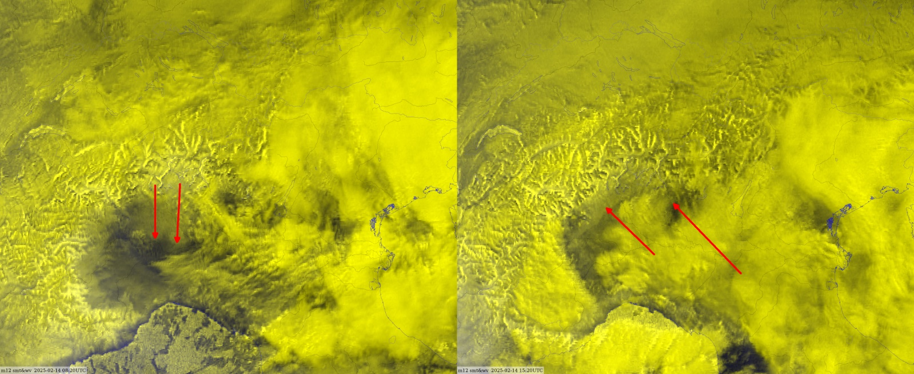
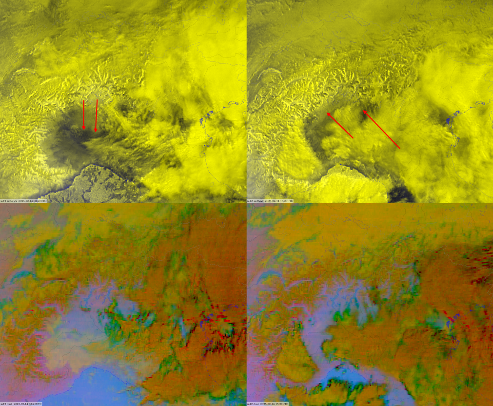
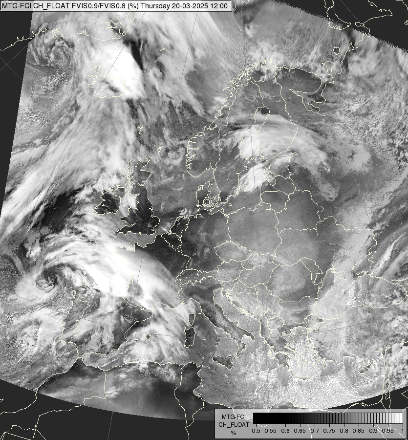
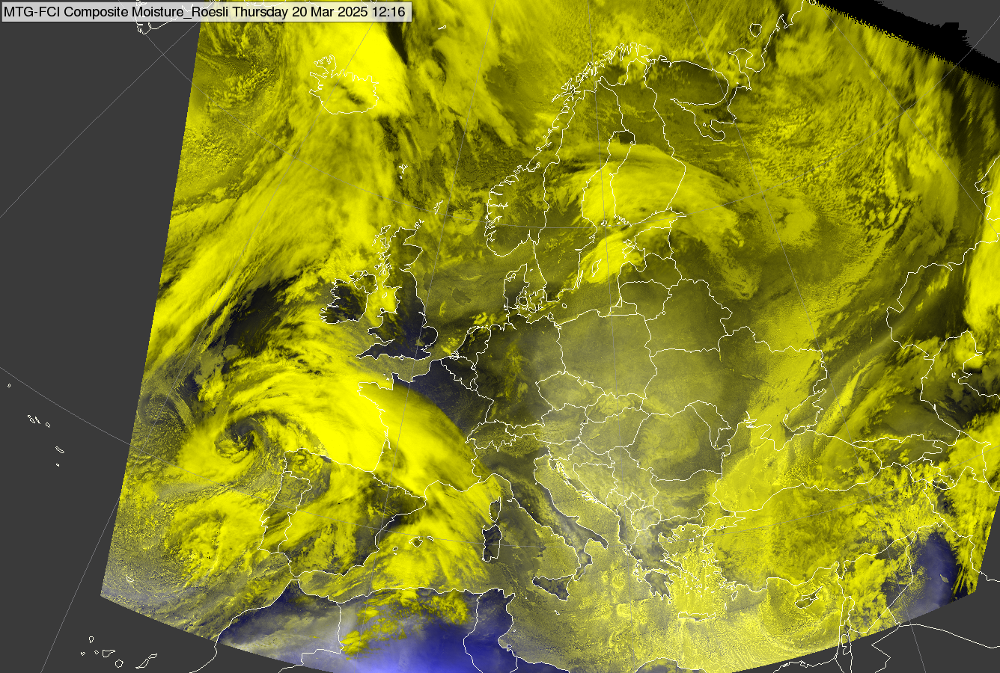
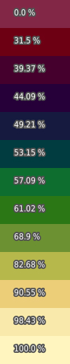
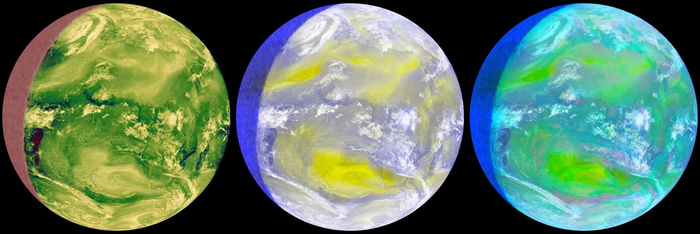

# Day Moisture RGB

## Main applications

- Detection and monitoring of low level (ie total column) moisture fields.

## Remarks

- This RGB is newly introduced to MTG FCI.
- Among current GEO imagers, only FCI includes the NIR0.9 band, enabling this RGB.
- Uses a ratio of NIR0.9/VIS0.8 (rather than channel difference).
- Proposed names for this RGB include *Water Vapour Transmittance* or *Total Moisture Imagery* to better describe this composite.
- The NIR0.91 channel provides information on vertically integrated water vapour content in the atmosphere (typically dominated by lower tropospheric levels).

Reference: Gao & Kaufman (2003), Water vapor retrievals using Moderate Resolution Imaging Spectroradiometer (MODIS) near-infrared channels, *J. Geophys. Res.*, 108(D13), 4389. <https://doi.org/10.1029/2002JD003023>.

## Development Notes

- Several RGB variants using the NIR0.9/VIS0.8 ratio are under testing.
- Neither the final recipe nor the name of this RGB has been finalized.
- qTPW (quasi-Total Precipitable Water): best visualized through (fast) animations, enabling quasi cloud masking as perceived by the human eye.
- No solar zenith angle correction needed neither for "smt" (NIR0.9/VIS0.8 ratio) nor for the Day moisture RGB.

On the figure below:

- Left image: foehn phase in the early morning -- bright area spreading south.
- Right image: easterly backflow (bora type) over Po Valley in the afternoon -- dark area under clouds advancing westward.
- No clear sign of moisture fields in compared Dust RGB.

14 February 2025, 14:08 & 15:20 UTC

## Preliminary FCI Moisture RGB

| Colour beam | Channel (difference) | Range min | Range max | Unit | Gamma |
|-------------|----------------------|-----------|-----------|------|-------|
| Red         | NIR0.9/VIS0.8        | 0.6       | 1         |  | 0.8 |
| Green       | NIR0.9/VIS0.8        | 0.6       | 1         |  | 0.8 |
| Blue        | WV7.3                | 230       | 270       | K | 0.3 |

Météo-France tested three different algorithms to enhance the visualization of moisture fields: two RGB variants and ESSL visualization (using NIR0.9/VIS0.8 ratio):

### ESSL Colour Palette Version (Left Image)

- NIR0.9 / VIS0.8 visualized with a colour palette.

### RGB Variant 1 (Right Image)

Uses the following RGB configuration:

| Colour beam | Channel (difference) | Range min | Range max | Unit | Gamma |
|-------------|----------------------|-----------|-----------|------|-------|
| Red         | VIS0.6               | 0         | 100       | %    | 1.4   |
| Green       | NIR0.9/VIS0.8        | 0         | 100       | %    | 1.0   |
| Blue        | WV7.3                | 270       | 230       | K    | 3.3   |

### H.-P. Roesli Variant (Middle Image)

Same green and blue component as variant 1, but applies different gamma settings for the blue channel (exact value range is not confirmed).

| Colour beam | Channel (difference) | Range min | Range max | Unit | Gamma |
|-------------|----------------------|-----------|-----------|------|-------|
| Red         | VIS0.9/VIS0.8        | 0         | 100       | %    | 1.0   |
| Green       | NIR0.9/VIS0.8        | 0         | 100       | %    | 1.0   |
| Blue        | WV7.3                | 270       | 230       | K    | 3.3   |

## Next steps / recommendations

- Determine whether this RGB provides significant benefits over a simple SMT (VIS0.9/VIS0.8 ratio) imagery.
- Explore the inclusion of additional channels to diversify input (currently, both red and green beams rely on similar ratio inputs).
- Consider adding cloud-sensitive channels (e.g., NIR1.38, NIR0.91, VIS0.8), as current output may appear overly yellow.
