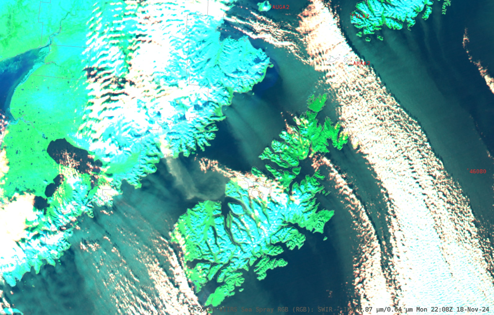

# Day Sea Spray RGB

Alternative name: *Sea Spray RGB*

## Main applications

- Detection of sea spray and other aerosols over water, particularly in cold regions.

## Remarks

- Sea spray may indicate the presence of freezing spray, which poses a significant maritime hazard, especially during winter conditions.
- This RGB is specifically tuned for high-latitude environments, where freezing spray events are more likely.
- Sea spray typically appears in light blue, cyan, or gray, over a dark blue water serface.
- Other aerosols may appear light blue, pink, gray, or white, depending on their optical thickness, solar illumination, and viewing geometry.
- Land surfaces are rendered as:
  - light green if snow-free
  - light cyan if snow-covered
  - white, depending on surface temperature.
- Clouds appear white.
- Sun glint may affect image interpretation.
- Validation to date is limited to the Gulf of Alaska, using ABI and VIIRS data.

## ABI Day Sea Spray RGB

| Colour beam | Channel (difference) | Range min | Range max | Unit | Gamma |
|-------------|----------------------|-----------|-----------|------|-------|
| Red         | IR3.9 - IR10.4       | 0         | 5         | K    | 1.0   |
| Green       | NIR0.86              | 1         | 9         | %    | 5/3   |
| Blue        | VIS0.64              | 2         | 12        | %    | 5/3   |

## VIIRS Day Sea Spray RGB

| Colour beam | Channel (difference) | Range min | Range max | Unit | Gamma |
|-------------|----------------------|-----------|-----------|------|-------|
| Red         | IR3.7 - IR11.4       | 0         | 10        | K    | 1.0   |
| Green       | NIR0.86              | 1         | 20        | %    | 5/3   |
| Blue        | VIS0.64              | 2         | 25        | %    | 5/3   |

## Next steps / Recommendations

- More validation is required across:
  - Additional satellite sensors
  - Different regions globally where sea spray is a concern
- Feedback from the operational users is required.
