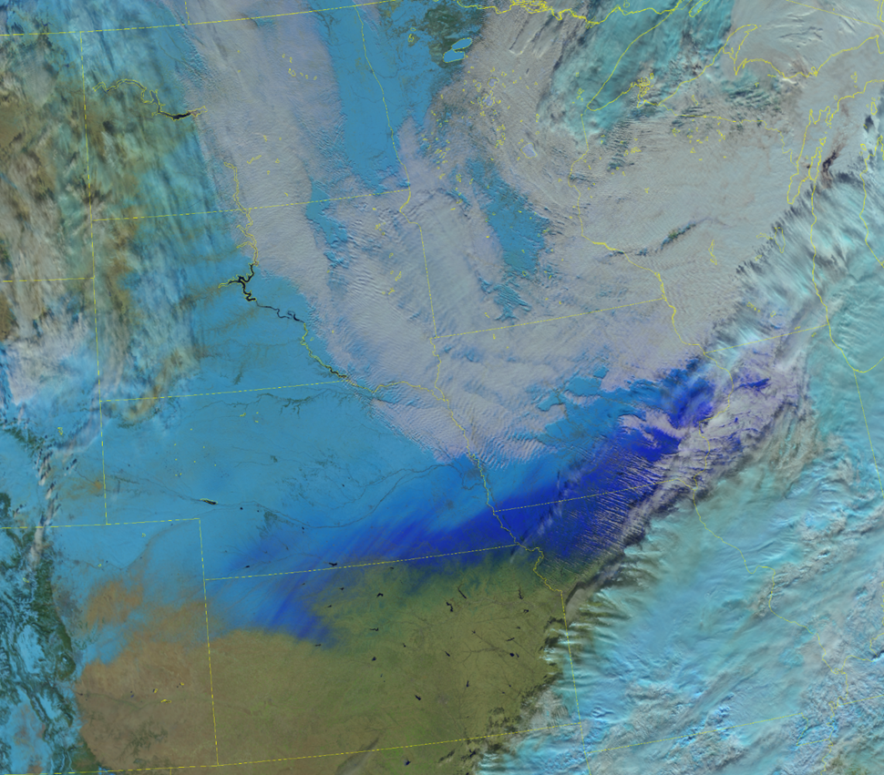

# Day Snowmelt RGB

Alternative name: *Snowmelt RGB*

## Main applications

- Characterization of surface snow and ice properties.
- Detection of freezing rain, sleet, mixed precipitation, or ice pellet accumulations.

## Remarks

- Dry snow and small-grain snow typically appear light blue to cyan. Wet snow and large-grain snow appear medium to dark blue, while freezing rain, sleet, or ice pellet accumulations tend to appear dark blue. Imagery has a similar appearance and interpretation as the *Day Land Cloud RGB*.
- This RGB can be used to detect fresh snow on top of older snow, and rain-on-snow features.
- As snow ages, melts, or partially melts and re-freezes, its brightness decreases, appearing darker in the imagery. This darkening suggests reduced potential for snow to be lofted by high winds, making this RGB valuable for use alongside with the *Blowing Snow RGB* to monitor for ground blizzards.
- This RGB may be used to detect potential avalanche conditions, though interpretation can be challenging due to terrain- and forest-induced shadows, and cloud cover.
- Utilizes the NIR1.24 channel, which is not currently available on any geostationary satellites.

## VIIRS Day Snowmelt RGB

| Colour beam | Channel (difference) | Range min | Range max | Unit | Gamma |
|-------------|----------------------|-----------|-----------|------|-------|
| Red         | NIR1.61              | 0         | 125       | %    | 2.0   |
| Green       | NIR1.24              | 0         | 125       | %    | 2.0   |
| Blue        | VIS0.64              | 0         | 125       | %    | 2.0   |
