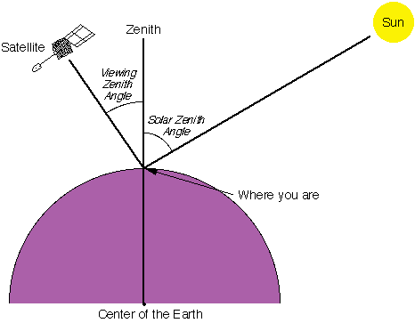

# Definitions & Naming Conventions

## Definitions

This document explains how to create WMO-recommended standard RGB composites using data from the new-generation imagers aboard geostationary meteorological satellites ("GEO ring") operated by the United States, Europe, China, and Japan that are most commonly used in operational weather forecasting.

An RGB composite refers to a visual product created by combining spectral channel radiances or derived quantities such as reflectance (%) or brightness temperature (Kelvin degrees), measured by a passive multi-spectral satellite sensor, and mapping them into the Red-Green-Blue (RGB) colour space. In some cases, gamma correction is applied to enhance the visual representation.

These standard recipes are based on community-developed guidance established over the past two decades (see Workshop reports 2007, 2012, 2017, 2022, and 2025).

Note: While the terms "channel" and "band" are often used interchangeably, this document uses the term "channel" throughout for consistency.

The table below outlines the parameters required to define an RGB composite, commonly referred to as an RGB "recipe". General guidance on how to create or adapt an RGB scheme is available through resource such as *How to create or adapt an RGB scheme* ([EUMETrain](https://resources.eumetrain.org/data/7/737/index.htm)).

| Colour beam | Channel (or combination) | Range min | Range max | Unit | Gamma |
|-------------|---------------------------|-----------|-----------|------|-------|
| Red         | ...                       | Red_1     | Red_2     | K or % | Gamma1 |
| Green       | ...                       | Green_1   | Green_2   | K or % | Gamma2 |
| Blue        | ...                       | Blue_1    | Blue_2    | K or % | Gamma3 |

Template for parameters used in RGB recipes.

The second column indicates the channels or channel combinations that should be visualized in the red, green and blue colour beams in the composite.

### Input and preprocessing guidance

- Input data should be the default calibrated radiances provided in near-real time for each channel by the satellite operator. This should be converted into reflectance (%) or brightness temperature (K) using a formula supplied by the satellite operator. If digital counts are provided instead, they must first be converted into radiances using an operator-specific calibration formula.

1. For solar channels, calibration should include a solar zenith angle (SZA) correction, using the method proposed by *Li and Shibata* (2006)[^1]. This method results in smoother imagery and better preserves information compared to the simple 1/cos (SZA) correction at the terminator.
2. A Rayleigh scattering correction can be applied for channels in shortwave range (approximately 400-600 nm) that are sensitive to atmospheric scattering. This correction is recommended for generating the True Colour RGB, while optional for other RGBs. In particular, for the VIS0.6 channel, since the impact is small, and the correction is adding extra computational time.
3. No limb cooling correction should be applied.
4. No parallax correction should be applied.

### Image Enhancement: Range and Gamma Correction

The RGB images should be enhanced using the defined range and gamma values—as specified in columns 3, 4, 5, and 6 of the table above.

The input values (reflectance or brightness temperature) should be *linearly stretched* within the specified range (columns 3 and 4, e.g., *Red_1* and *Red_2*) to span the full display brightness scale (0-255, BYTE). The units for the range are indicated in column 5 either Kelvin (K) for brightness temperature or percent (%) for reflectance.

- In most cases, the value in column 3 (e.g., *Red_1*) is lower than the value in column 4 (*Red_2*).
- In some RGB recipes, the range is inverted, meaning the lower bound is numerically greater than the upper bound.

In addition to linear stretching, *non-linear enhancement* may also be applied through gamma correction (see sixth column in the table).

- If Gamma > 1, the image becomes brighter, with enhanced contrast in darker tones.
- If Gamma < 1, the image becomes darker, with enhanced contrast in brighter tones.
- If Gamma = 1, no gamma correction is applied (i.e., only linear stretching).

Gamma Correction Equation:

$$\mathbf{BYTE = 255*\ }\left( \frac{\mathbf{X - RANGE\_1}}{\mathbf{RANGE\_2 - RANGE\_1}} \right)^{\frac{\mathbf{1}}{\mathbf{Gamma}}}$$

where:

- X -- input calibrated value (reflectivity or brightness temperature)
- RANGE_1 and RANGE_2 -- minimum and maximum values for stretching (e.g., *Red_1* and *Red_2*)
- Gamma -- gamma correction parameter
- BYTE -- output display value (ranging from 0 to 255)

The figure below illustrates the effect of the gamma correction.

It is recommended practice to apply gamma correction using the parameter as defined in the equation above (see *WMO Tokyo workshop 2017 report* and <https://en.wikipedia.org/wiki/Gamma_correction>). Please note that some users and software tools may define the exponent differently using Gamma where this guidance uses 1/Gamma, effectively naming Gamma as the reciprocal of the value recommended here.

Solar Zenith Angle (SZA): angle between the sun and the vertical direction.

The Flexible Combined Imager (FCI) on the Meteosat Third Generation (MTG) satellites generates data for some channels at two spatial resolutions simultaneously, for example IR10.5 µm at both 1 km (high resolution) and 2 km (nominal resolution).

When combining multiple channel data with other channels within the same colour beam, to avoid visual artefacts, it is recommended to use data at the same spatial resolution. For instance, when constructing the red component of Night Microphysics RGB, use IR10.5 2 km in combination with IR12.3 2 km data. Avoid mixing different-resolution inputs such as IR12.3 at 2 km (resampled to 1 km) with IR10.5 at 1 km—this can result in artefacts and degraded image quality.

However, one can use different spatial resolutions in different colour beams. For example, in the Night Microphysics RGB, the red colour beam can be based on IR12.3 -- IR10.5 at 2 km resolution, resampled to 1 km, while the green and blue beams may use IR10.5 -- IR3.8 and IR10.5 at 1 km resolution, respectively—without introducing artefacts.

This document presents WMO-recommended standards. Users should note that RGB recipes are subject to regular review and revision based on operational feedback, testing, and research and development. This is particularly relevant for RGBs based on new-generation sensors—such as the FCI on MTG satellites, operational as of 2025.

Example recipe for the Meteosat SEVIRI 24h Microphysics Cloud RGB:

| Colour beam | Channel (difference) | Range min | Range max | Unit | Gamma |
|-------------|----------------------|-----------|-----------|------|-------|
| Red         | IR12.0 -- IR10.8     | -4        | +2        | K    | 1.0   |
| Green       | IR10.8 -- IR8.7      | 0         | +6        | K    | 1.2   |
| Blue        | IR10.8               | 248       | 303       | K    | 1.0   |

## Naming Conventions[^2]

| Full name | Alternative / short name | Spanish translation | German translation |
|-----------|---------------------------|---------------------|--------------------|
| **Basic RGBs** |  |  |  |
| 24-hour Microphysics Cloud RGB | 24-h Microphysics RGB | RGB Microfisica de nubes 24h | 24h Mikrophysik RGB |
| Night Microphysics RGB | Fog RGB, Night Fog RGB, Fog/Low Cloud RGB, Fog/Low Stratus RGB | RGB Niebla | Nacht Mikrophysik-RGB |
| Day Cloud Phase RGB | Cloud Phase RGB | RGB Fase de nube | Wolkenphase RGB |
| Day Cloud Type RGB | Cloud Type RGB | RGB Tipo de nube | Wolkentyp-RGB |
| **Special Applications RGBs** |  |  |  |
| 24-hour Microphysics Dust RGB | Dust RGB | RGB Polvo | Staub RGB |
| 24-hour Microphysics CVD Dust RGB | CVD Dust RGB |  |  |
| 24-hour Microphysics Ash RGB | Ash RGB | RGB Cenizas volcanicas | Asche RGB |
| Day Severe Storms RGB | Convection RGB, Severe Storms RGB, Severe Convection RGB | RGB Tormentas Severas | Schwere Konvektion-RGB |
| Volcanic Emissions (SO2 and Ash) RGB | SO2 and Ash RGB |  |  |
| Day Fire RGB | Day Land Cloud Fire RGB, Natural Fire Colour RGB |  |  |
| Day Snowmelt RGB | Snowmelt RGB |  |  |
| **Legacy RGBs** |  |  |  |
| Day Land Cloud RGB | Natural Colour RGB |  |  |
| Day Snow-Fog RGB | Snow RGB |  |  |

[^1]: Li, J. and Shibata, K. (2006). On the Effective Solar Pathlength. *Journal of the Atmospheric Sciences* 63(4) pp. 1365-1373.
[^2]: No proposed translation into French, Arabic since Météo-France and VLab Oman Centre of Excellence recommend using the English terminology.
