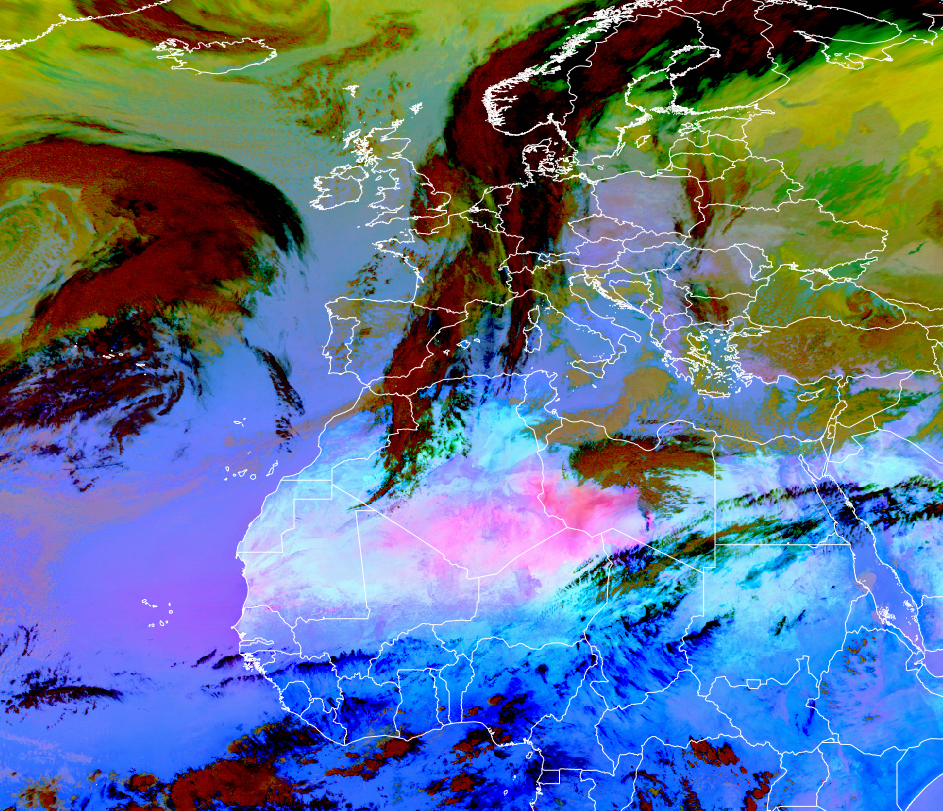

# 24-hour Microphysics Dust RGB

Alternative name: *Dust RGB*

## Main applications

-   24-hour dust detection

-   24-hour detection of moisture boundaries over cloud-free areas

-   24-hour detection of clouds (note: low-level clouds may not always
    be identified)

-   24-hour detection of cloud phase

## Remarks

-   This RGB uses the same channel combination as for the *24-hour
    Microphysics Cloud RGB*, but with different value ranges applied.

-   Low clouds may not always be detected, which can lead to false
    identification of moisture boundary.

-   This RGB is particularly useful when the *24-hour Microphysics Cloud
    RGB* becomes saturated or lacks sufficient contrast. In such cases,
    the *Dust RGB*---based on the same channels but with different
    tuning---should be used instead.

## RGB Recipes by Satellite Instrument

### MSG SEVIRI Dust RGB

| Colour beam | Channel (difference) | Range min | Range max | Unit | Gamma |
|-------------|----------------------|-----------|-----------|------|-------|
| Red         | IR12.0 -- IR10.8     | -4        | +2        | K    | 1.0   |
| Green       | IR10.8 -- IR8.7      | 0         | +15       | K    | 2.5   |
| Blue        | IR10.8               | 261       | 289       | K    | 1.0   |

### MTG FCI Dust RGB

| Colour beam | Channel (difference) | Range min | Range max | Unit | Gamma |
|-------------|----------------------|-----------|-----------|------|-------|
| Red         | IR12.0 -- IR10.8     | -7.1      | +2.4      | K    | 1.0   |
| Green       | IR10.5 -- IR8.7      | 0.2       | 12.7      | K    | 2.5   |
| Blue        | IR10.8               | 260.9     | 289.0     | K    | 1.0   |

### GOES ABI Dust RGB

| Colour beam | Channel (difference) | Range min | Range max | Unit | Gamma |
|-------------|----------------------|-----------|-----------|------|-------|
| Red         | IR12.3 -- IR10.3     | -6.7      | +2.6      | K    | 1.0   |
| Green       | IR11.2 -- IR8.4      | -0.5      | +20       | K    | 2.5   |
| Blue        | IR10.3               | 261.2     | 288.7     | K    | 1.0   |

### Himawari AHI Dust RGB

| Colour beam | Channel (difference) | Range min | Range max | Unit | Gamma |
|-------------|----------------------|-----------|-----------|------|-------|
| Red         | IR12.4 -- IR10.4     | -7.5      | +3        | K    | 1.0   |
| Green       | IR11.2 -- IR8.6      | -0.5      | +15.0     | K    | 2.2   |
| Blue        | IR10.4               | 261.5     | 289.2     | K    | 1.0   |

### FY-4 AGRI Dust RGB

| Colour beam | Channel (difference) | Range min | Range max | Unit | Gamma |
|-------------|----------------------|-----------|-----------|------|-------|
| Red         | IR12.0 -- IR10.8     | -4.0      | +2        | K    | 1.0   |
| Green       | IR10.8 -- IR8.55     | 0.0       | +15.0     | K    | 2.5   |
| Blue        | IR10.8               | 261.0     | 289.0     | K    | 1.0   |

## Variant for users with Colour Vision Deficiency (CVD)

Full name: *24-hour Microphysics CVD Dust RGB*

Alternative name: *CVD Dust RGB*

### Main applications

-   24-hour dust detection

-   24-hour detection of moisture boundaries over cloud-free areas

-   24-hour detection of clouds (note: low-level clouds may not always
    be identified)

-   24-hour detection of cloud phase

### Remarks

-   This variant of the RGB is designed specifically for users with
    Colour Vision Deficiency (CVD).

-   Low clouds may not always be detected, which can lead to false
    detection of moisture boundary.

-   This RGB is particularly useful when the *24-hour Microphysics Cloud
    RGB* becomes saturated or lacks sufficient contrast. In such cases,
    the *Dust RGB* based on the same channels but with different tuning
    should be used instead.

### GOES ABI CVD Dust RGB

| Colour beam | Channel (difference) | Range min | Range max | Unit | Gamma |
|-------------|----------------------|-----------|-----------|------|-------|
| Red         | IR10.3 -- IR8.4      | +6        | -0.5      | K    | 0.67  |
| Green       | IR12.3 -- IR10.3     | -6        | +2.5      | K    | 0.67  |
| Blue        | IR10.3               | 233       | 313       | K    | 1.0   |
