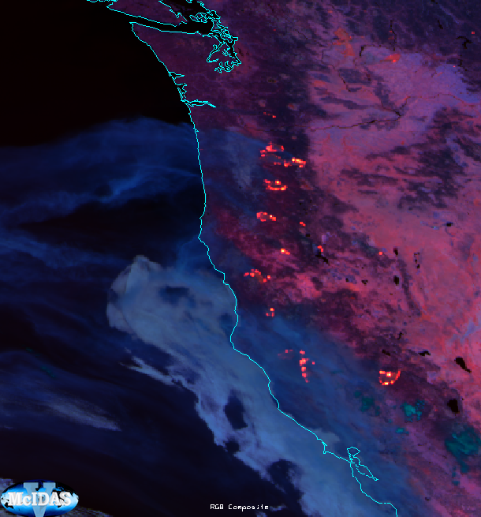

# Fire Temperature RGB

## Main applications

-   24-hour fire detection

-   24-hour qualitative assessment of fire intensity

## Remarks

-   Two recipe variants may exist:

    -   One using radiance values (preferred if available)

    -   One using unnormalized reflectance and brightness temperature
        values

-   To detect small or moderately hot fires, usage of high spatial
    resolution channels is recommended (e.g. FCI NIR2.2 at 0.5 km
    resolution).

-   Nighttime: limited background information is available (e.g. clouds,
    smoke, and surface features).

-   Daytime: burnt areas, water bodies, and ice clouds are visible.
    Smoke is usually not detectable unless it is very dense, and mainly
    over the sea. Other atmospheric and surface features are generally
    not well represented in this RGB.

-   Very hot surfaces may mask fire signals by saturating the red
    channel.

-   Sun glint may affect image interpretation.

## RGB Recipes by Satellite Instrument

### SNPP/NOAA-20/21 VIIRS Fire Temperature RGB

| Colour beam | Channel | Range min | Range max | Unit | Gamma |
|-------------|---------|-----------|-----------|------|-------|
| Red         | IR3.7   | 0         | 3.5       | W m⁻² sr⁻¹ µm⁻¹ | 1 |
| Green       | NIR2.25 | 0         | 35.0      | W m⁻² sr⁻¹ µm⁻¹ | 1 |
| Blue        | NIR1.6  | 0         | 85.0      | W m⁻² sr⁻¹ µm⁻¹ | 1 |

### MTG FCI Fire Temperature RGB

Radiance-based recipe (preferred):

| Colour beam | Channel | Range min | Range max | Unit | Gamma |
|-------------|---------|-----------|-----------|------|-------|
| Red         | IR3.8   | 0         | 5.1       | W m⁻² sr⁻¹ µm⁻¹ | 1 |
| Green       | NIR2.25 | 0         | 17.7      | W m⁻² sr⁻¹ µm⁻¹ | 1 |
| Blue        | NIR1.6  | 0         | 22.0      | W m⁻² sr⁻¹ µm⁻¹ | 1 |

Reflectance / brightness-temperature recipe:

| Colour beam | Channel | Range min | Range max | Unit | Gamma |
|-------------|---------|-----------|-----------|------|-------|
| Red         | IR3.8   | 273       | 333\*     | K    | 0.4   |
| Green       | NIR2.25 | 0         | 100\*\*   | %    | 1     |
| Blue        | NIR1.6  | 0         | 75\*\*    | %    | 1     |

### GOES ABI Fire Temperature RGB

Reflectance / brightness-temperature recipe:

| Colour beam | Channel | Range min | Range max | Unit | Gamma |
|-------------|---------|-----------|-----------|------|-------|
| Red         | IR3.9   | 273       | 333\*     | K    | 0.4   |
| Green       | NIR2.2  | 0         | 100\*\*   | %    | 1     |
| Blue        | NIR1.6  | 0         | 75\*\*    | %    | 1     |

Same notes apply as for MTG FCI.

### Himawari AHI Fire Temperature RGB

Reflectance / brightness-temperature recipe:

| Colour beam | Channel | Range min | Range max | Unit | Gamma |
|-------------|---------|-----------|-----------|------|-------|
| Red         | IR3.9   | 273       | 350       | K    | 1.0   |
| Green       | NIR2.3  | 0         | 50\*\*    | %    | 1.0   |
| Blue        | NIR1.6  | 0         | 50\*\*    | %    | 1.0   |

Radiance-based recipe:

| Colour beam | Channel | Range min | Range max | Unit | Gamma |
|-------------|---------|-----------|-----------|------|-------|
| Red         | IR3.9   | 0.15      | 3.2       | W m⁻² sr⁻¹ µm⁻¹ | 1.5 |
| Green       | NIR2.3  | 0         | 12        | W m⁻² sr⁻¹ µm⁻¹ | 1.0 |
| Blue        | NIR1.6  | 0         | 39        | W m⁻² sr⁻¹ µm⁻¹ | 1.0 |

!!! note "Notes"
    \* In hot and arid regions, the upper limit of the red range is
    recommended to be adjusted to 343 K to avoid saturation under
    non-fire conditions.

    \*\* Calibrated NIR2.2 and NIR1.6 values should not be normalized
    with the sun zenith angle (i.e. no sun zenith angle correction
    should be applied for these channels) as thermal radiation is
    detected in these bands during fire events.
