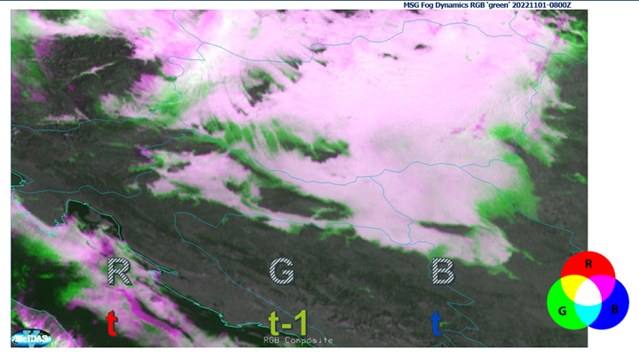

# 24h Fog Dynamics RGB

This RGB uses high-resolution channel reflectance during the day (e.g. FCI VIS0.6) and brightness temperature differences (BTD) at night. It compares two-time steps to capture changes in cloud formation and dissipation, as well as changes in cloud thickness.

## Main applications

- Simple way of detecting fog and monitoring of fog formation, dissipation and changes in thickness.

## Remarks

- Day/Night Fog Dynamics RGB.
- Enables a near-binary interpretation of fog formation vs dissipation.
- The time step between images (e.g. 10 min) can be adjusted (e.g. 15 min, 30 min, 1 hour) depending on fog dynamics.
- Could also support analysis of convection and other rapidly evolving phenomena.
- Visualisation (as it requires access to previous time step data.

## Next steps / Recommendations

- Further validation is needed, particularly from operational users.
- Investigate the need for sun angle correction, especially near the terminator, where different sun angles between time steps may introduce bias.
- Further possibilities of similar products with higher derivative of radiances in time, df/dt (change) or df2/dt2 (speed of change) → possibly conceptualized as *Fog Speed RGB*.

## 24h Fog Dynamics RGB Recipe

| Colour beam | Channel | Range min | Range max | Unit | Gamma |
|-------------|---------|-----------|-----------|------|-------|
| Red         | High-res VIS/NIR daytime | 0  | 80 | % | 1 |
| Red         | BTD10.5-3.8 night (t) | -2 | 9 | K | 1 |
| Green       | High-res VIS/NIR daytime | 0 | 80 | % | 1 |
| Green       | BTD10.5-3.8 night (t-10 min) | -2 | 9 | K | 1 |
| Blue        | High-res VIS/NIR daytime | 0 | 80 | % | 1 |
| Blue        | BTD10.5-3.8 night (t) | -2 | 9 | K | 1 |
