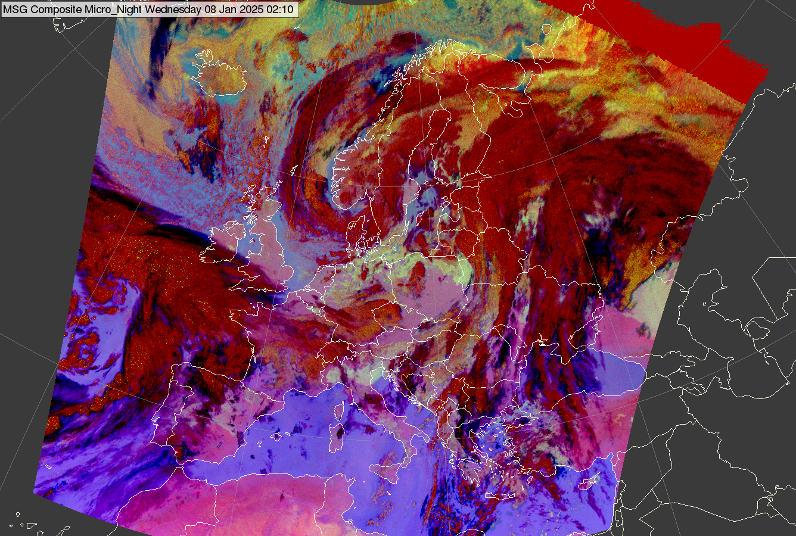

# Night Microphysics RGB

Alternative names: *Fog RGB*, *Fog/Low Clouds RGB*

## Main applications (Nighttime)

- Detection of clouds, with emphasis on fog and low-level clouds.
- Detection of moisture boundaries in cloud-free areas.
- Dust detection.

## Remarks

- Variants with different tuning for tropical regions are available (see below).
- The RGB performs poorly in twilight conditions and in very cold environments.
- The current FCI-based recipe has a known limitation: saturation for some low clouds. Further tuning is planned to address this issue in future updates.

## RGB Recipes by Satellite Instrument

### MSG SEVIRI Night Microphysics RGB

| Colour beam | Channel (difference) | Range min | Range max | Unit | Gamma |
|-------------|----------------------|-----------|-----------|------|-------|
| Red         | IR12.0 -- IR10.8     | -4        | +2        | K    | 1.0   |
| Green       | IR10.8 -- IR3.9      | 0         | +10       | K    | 1.0   |
| Blue        | IR10.8               | 243       | 293       | K    | 1.0   |

### MTG FCI Night Microphysics RGB

| Colour beam | Channel (difference) | Range min | Range max | Unit | Gamma |
|-------------|----------------------|-----------|-----------|------|-------|
| Red         | IR12.3-10.5          | -4        | +2        | K    | 1.0   |
| Green       | IR10.5 -- IR3.8      | -4        | +6        | K    | 1.0   |
| Blue        | IR10.5               | 243       | 293       | K    | 1.0   |

### GOES ABI Night Microphysics RGB

| Colour beam | Channel (difference) | Range min | Range max | Unit | Gamma |
|-------------|----------------------|-----------|-----------|------|-------|
| Red         | IR12.3 -- IR10.3     | -6.7      | +2.6      | K    | 1.0   |
| Green       | IR10.3 -- IR3.9      | -3.1      | +5.2      | K    | 1.0   |
| Blue        | IR10.3               | 243.6     | 292.7     | K    | 1.0   |

### Himawari AHI Night Microphysics RGB

| Colour beam | Channel (difference) | Range min | Range max | Unit | Gamma |
|-------------|----------------------|-----------|-----------|------|-------|
| Red         | IR12.4 -- IR10.4     | -7.5      | +3        | K    | 1.0   |
| Green       | IR10.4 -- IR3.9      | -2.9      | +7        | K    | 1.0   |
| Blue        | IR10.4               | 243.7     | 293.2     | K    | 1.0   |

### FY-4 AGRI Night Microphysics RGB

| Colour beam | Channel (difference) | Range min | Range max | Unit | Gamma |
|-------------|----------------------|-----------|-----------|------|-------|
| Red         | IR12.0 -- IR10.8     | -4        | +2        | K    | 1.0   |
| Green       | IR10.8 -- IR3.75     | 0         | +10       | K    | 1.0   |
| Blue        | IR10.8               | 243       | 293       | K    | 1.0   |

## Variants for Tropical Regions

Tropical regions require adjusted tuning due to a higher tropopause and increased atmospheric moisture, which affect radiance signals particularly in the mid- and long-wave infrared channels. For this reason, the RGB stretching ranges are modified accordingly.

### MSG SEVIRI Night Microphysics RGB -- for tropics

| Colour beam | Channel (difference) | Range min | Range max | Unit | Gamma |
|-------------|----------------------|-----------|-----------|------|-------|
| Red         | IR12.0 -- IR10.8     | -4        | +2        | K    | 1.0   |
| Green       | IR10.8 -- IR3.9      | 0         | +5        | K    | 1.0   |
| Blue        | IR10.8               | 273       | 300       | K    | 1.0   |

### MTG FCI Night Microphysics RGB -- for tropics

| Colour beam | Channel (difference) | Range min | Range max | Unit | Gamma |
|-------------|----------------------|-----------|-----------|------|-------|
| Red         | IR12.0 -- IR10.5     | -7.1      | +2.4      | K    | 1.0   |
| Green       | IR10.5 -- IR3.8      | -2.9      | +1.1      | K    | 1.0   |
| Blue        | IR10.5               | 273       | 300       | K    | 1.0   |
