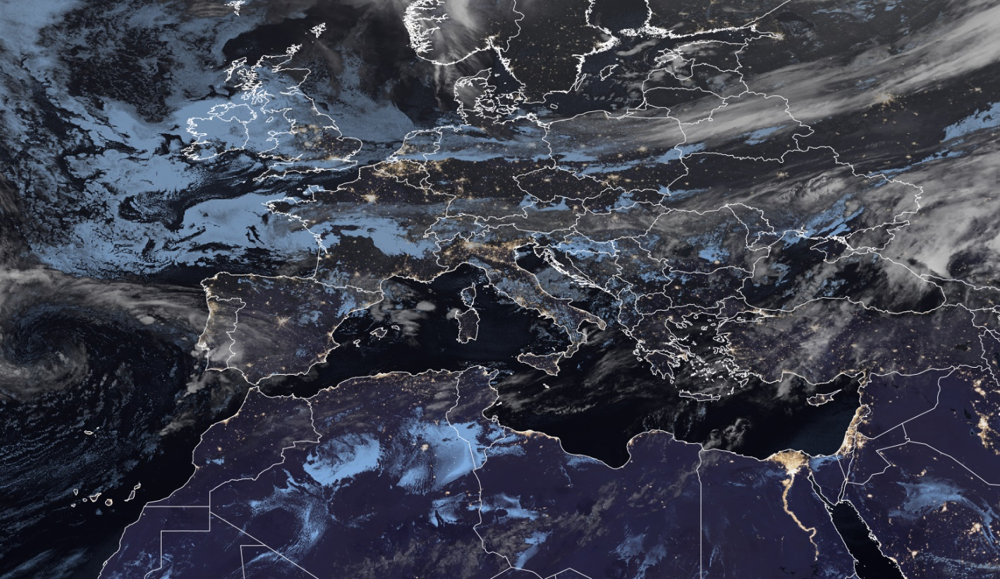

# Other Visualisations

This section describes commonly used satellite data visualisations that are not RGBs. Examples include GeoColour and the Sandwich product.

## GeoColour Visualisation

### Main application (Nighttime)

- Especially useful and visually compelling for use by the general public, media, and non-technical audiences.

### Remarks

- GeoColour is not an RGB composite, but a highly processed visualisation, intended primarily for communication and outreach, not operational forecasting.
- Applicable for GOES ABI, Himawari AHI, and newly introduced to MTG FCI.
- Because it involves extensive post-processing (multiple corrections applied), interpretation should be done with caution.
- For forecasting at night, the *Night Microphysics RGB* is recommended as the standard product for fog and low clouds detection. Land features may sometimes appear similar to low-level clouds, which may lead to misinterpretation.
- At nighttime, the IR10.5 channel and the brightness temperature difference (IR10.5 - IR3.8) are used to distinguish between high/mid-level clouds (whitish tones) and fog/low-level clouds (bluish tones). These cloud are semi-transparent and overlaid on a nighttime VIIRS-derived city lights layer.
- At daytime, the *True Colour RGB* is used.

### Next steps / Recommendations

- Further validation is required, particularly based on feedback from operational users.
- Consider integrating city lights as a separate visualization layer.
- GeoColour could also include additional layers such as lightning, fires, and dust.
