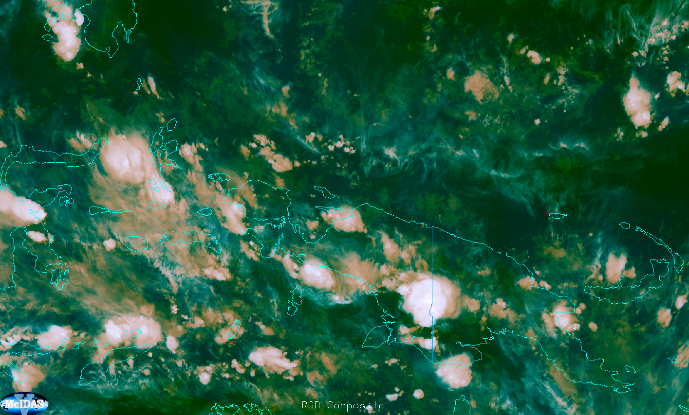

# Overshooting Tops RGB

## Main applications

- 24-hour monitoring of overshooting tops.

## Remarks

- This RGB is a variant of the basic *Airmass RGB*. It differs in the selected ranges and in the channel difference applied in the red component.

## RGB Recipes by Satellite Instrument

### MSG SEVIRI Overshooting Tops RGB

| Colour beam | Channel (difference) | Range min | Range max | Unit | Gamma |
|-------------|----------------------|-----------|-----------|------|-------|
| Red         | WV6.2 -- IR10.8      | -25       | +5        | K    | 1.0   |
| Green       | IR9.7 -- IR10.8      | -30       | +25       | K    | 1.0   |
| Blue        | WV6.2                | 243       | 190       | K    | 1.0   |

### MTG FCI Overshooting Tops RGB

| Colour beam | Channel (difference) | Range min | Range max | Unit | Gamma |
|-------------|----------------------|-----------|-----------|------|-------|
| Red         | WV6.3 -- IR10.5      | -23.8     | +6.4      | K    | 1.0   |
| Green       | IR9.7 -- IR10.5      | -29.9     | +23.6     | K    | 1.0   |
| Blue        | WV6.3                | 244.5     | 191.4     | K    | 1.0   |
