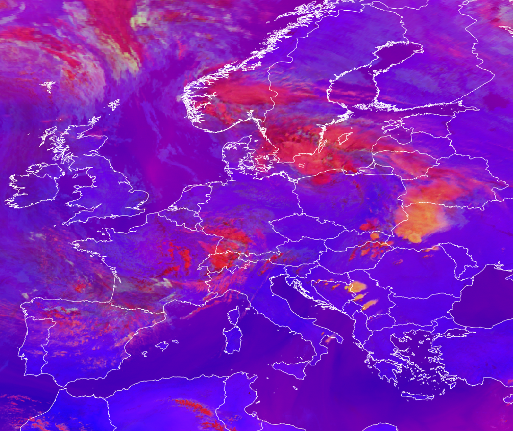

# Day Severe Storms RGB

Alternative names: *Severe Storms RGB, Convection RGB, Severe Convection RGB*

## Main applications (Daytime)

-   Detection of small ice particles at the top of the high-level clouds

-   Monitoring of convection, high-level lee clouds, heavily polluted
    high clouds, clouds with a high cloud base, and supercooled water
    clouds

## Remarks

-   This RGB is optimized for analyzing high ice clouds.

-   The green component, which strongly influences the presence of
    yellow tones in the composite, provides information on cloud top
    particle size. However, the signal is also somewhat influenced by
    cloud top temperature.

-   It gives strong colour contrast between ice clouds composed of large
    versus small or very cold particles.

-   The interpretation of ice particle size distribution is relatively
    straightforward. The *Cloud Phase RGB* may serve as a partial
    alternative for this RGB for ice cloud particle size distinction
    (although its sensitivity is lower) without cloud top temperature
    dependence. However, in some cases the two RGBs are complementary
    (e.g., in detecting supercooled cloud droplets).

-   A specific tuning for tropical regions is available (see variants
    below).

-   Note: Due to noise that may appear at very low temperatures in the
    FCI IR3.8 channel, green noisy pixels can occasionally be seen over
    the coldest cloud tops.

## RGB Recipes by Satellite Instrument

### MSG SEVIRI Day Severe Storms RGB

| Colour beam | Channel difference  | Range min | Range max | Unit | Gamma |
|-------------|---------------------|-----------|-----------|------|-------|
| Red         | WV6.2 -- WV7.3      | -35.0     | +5.0      | K    | 1     |
| Green       | IR3.9 -- IR10.8     | -5        | +60       | K    | 0.5   |
| Blue        | NIR1.6 -- VIS0.6    | -75       | +25       | %    | 1     |

### MTG FCI Day Severe Storms RGB

!!! info "Agreed upon at the online workshop 2026-05-13"
    Proposed (M. Putsay, 2026)

Tuned for mid-latitudes.
The visible channed 0.6µm should be sun-zenith corrected.

| Colour beam | Channel difference  | Range min | Range max | Unit | Gamma |
|-------------|---------------------|-----------|-----------|------|-------|
| Red         | WV6.3 -- WV7.3      | -33.9     | +6.4      | K    | 1     |
| Green       | IR3.8 -- IR10.5     | -5        | +70       | K    | 0.5   |
| Blue        | NIR1.6 -- VIS0.6    | -70       | +20       | %    | 1     |

### GOES ABI Day Severe Storms RGB

| Colour beam | Channel difference  | Range min | Range max | Unit | Gamma |
|-------------|---------------------|-----------|-----------|------|-------|
| Red         | WV6.2 - WV7.3       | -35       | +5        | K    | 1     |
| Green       | IR3.9 -- IR10.3     | -5        | +60       | K    | 0.5   |
| Blue        | NIR1.6 - VIS0.64   | -75       | +25       | %    | 1     |

### Himawari AHI Day Severe Storms RGB

| Colour beam | Channel difference      | Range min | Range max | Unit | Gamma |
|-------------|-------------------------|-----------|-----------|------|-------|
| Red         | WV6.2 - WV7.3           | -36.0     | +5        | K    | 1.0   |
| Green       | IR3.9 - IR10.4          | -1.0      | +61.0     | K    | 0.5   |
| Blue        | NIR1.6 - VIS0.64        | -80       | +26       | %    | 0.95  |

### FY-4 AGRI Day Severe Storms RGB

| Colour beam | Channel difference  | Range min | Range max | Unit | Gamma |
|-------------|---------------------|-----------|-----------|------|-------|
| Red         | WV6.2 -- WV6.95     | -35       | +5        | K    | 1     |
| Green       | IR3.75 -- IR10.8    | -5        | +60       | K    | 0.5   |
| Blue        | NIR1.6 -- VIS0.65   | -75       | +25       | %    | 1     |

## Variants for Tropical Regions

RGB variants tailored for tropical regions are needed to account for the
typically higher tropopause and greater atmospheric moisture compared to
mid-latitudes. These factors significantly influence the radiance signal
in mid- and long-wave infrared channels. As a result, ranges for image
stretching are adjusted compared to the standard RGB recipes to better
suit tropical atmospheric conditions.

### MSG SEVIRI Day Severe Storms RGB -- for tropics

| Colour beam | Channel difference  | Range min | Range max | Unit | Gamma |
|-------------|---------------------|-----------|-----------|------|-------|
| Red         | WV6.2 -- WV7.3      | -35       | +5        | K    | 1     |
| Green       | IR3.9 -- IR10.8     | -5        | +75       | K    | 0.33  |
| Blue        | NIR1.6 -- VIS0.6    | -75       | +25       | %    | 1     |
