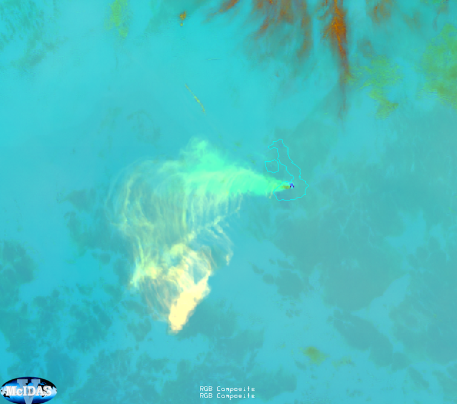

# Volcanic Emissions (SO₂ and Ash) RGB

Alternative name: *SO₂ and Ash RGB*

Previous name: *SO₂ RGB*

## Main applications

-   Detection of volcanic SO₂ gas plume and volcanic ash.

-   Enhanced detection capabilities compared to the *Ash RGB*. Both the
    red and the green components contribute to SO₂ gas plume
    identification.

-   This RGB may provide some information on SO₂ gas plume height.

-   Can also support detection of dust and ash.

## Remarks

-   The current FCI recipe for this RGB is directly adapted from the ABI
    recipe (requires further validation).

## RGB Recipes by Satellite Instrument

### MTG FCI SO₂ and Ash RGB

| Colour beam | Channel (difference) | Range min | Range max | Unit | Gamma |
|-------------|----------------------|-----------|-----------|------|-------|
| Red         | WV6.3 -- WV7.3       | -4.0      | +2.0      | K    | 1.0   |
| Green       | IR10.3 -- IR8.4      | -4.0      | +5.0      | K    | 1.0   |
| Blue        | IR10.3               | 243       | 303       | K    | 1.0   |

### GOES ABI SO₂ and Ash RGB

| Colour beam | Channel (difference) | Range min | Range max | Unit | Gamma |
|-------------|----------------------|-----------|-----------|------|-------|
| Red         | WV6.9 -- WV7.3       | -4.0      | +2.0      | K    | 1.0   |
| Green       | IR10.3 -- IR8.4      | -4.0      | +5.0      | K    | 1.0   |
| Blue        | IR10.3               | 243       | 303       | K    | 1.0   |

### Himawari AHI SO₂ and Ash RGB

| Colour beam | Channel (difference) | Range min | Range max | Unit | Gamma |
|-------------|----------------------|-----------|-----------|------|-------|
| Red         | WV6.9 -- WV7.3       | -5.0      | +6.0      | K    | 1.0   |
| Green       | IR11.2 -- IR8.6      | -5.9      | +5.1      | K    | 0.85  |
| Blue        | IR10.4               | 243.6     | 303.2     | K    | 1.0   |
