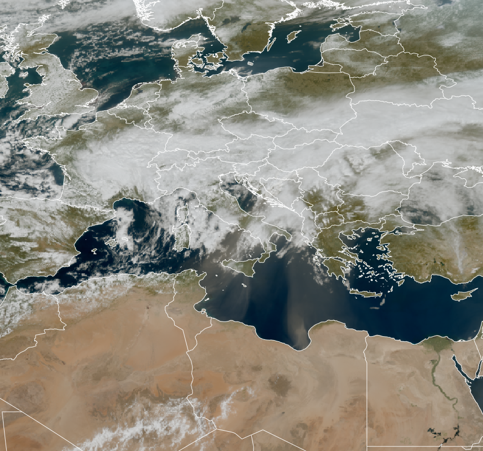

# True Colour RGB

## Main applications (Daytime)

-   Detection of aerosols (particularly over water surfaces): offers
    limited indication of aerosol type (less distinct than, for example,
    the *Day Land Cloud RGB*).

-   Monitoring of water bodies, including turbidity, algae blooms,
    chlorophyll concentrations, and white caps.

-   Detection of clouds and snow (including frost and rime), all
    appearing in white/grey tones: can suggest cloud thickness but does
    not distinguish cloud phase or particle size.

-   Visualization of vegetation signals (usually hybrid), e.g. detection
    of burnt areas.

-   Communication tool for public outreach, due to its natural colour
    rendering that resembles what the human eye perceives.

## Remarks

-   True Colour RGB is sometimes produced without Rayleigh correction or
    even solar zenith angle (SZA) correction, especially when processing
    capabilities are limited or when preserving a realistic Earth-space
    view is preferred.

-   Reflectance values are typically scaled logarithmically to better
    simulate the human eye's perception.

-   This RGB is highly effective for aerosol detection, particularly in
    conditions involving strong forward or backward scattering over
    water surfaces.

## General RGB recipe for all Satellite Instruments

| Colour beam | Channel | Range min | Range max | Unit | Gamma |
|-------------|---------|-----------|-----------|------|-------|
| Red         | VIS0.6  | 0         | 100       | %    | NA    |
| Green       | VIS0.5  | 0         | 100       | %    | NA    |
| Blue        | VIS0.4  | 0         | 100       | %    | NA    |

## RGB Recipes by Satellite Instrument

### Himawari AHI True Colour RGB

Steps for creating the AHI True Colour RGB (based on [Miller et al., 2016](https://doi.org/10.1175/BAMS-D-15-00154.1)):

-   The reflectance values from the VIS0.47, VIS0.51, VIS0.64 and
    NIR0.86 channels are normalised using atmospheric transmittance
    along the Sun--Earth--satellite photon path. A recommended method
    for solar zenith angle (SZA) correction is provided in *Li and
    Shibata (2006)*.

-   Rayleigh correction is typically applied to the reflectance values
    from the VIS0.47, VIS0.51, VIS0.64 and NIR0.86 channels to enhance
    image contrast and clarity. However, to avoid overcorrection in
    areas with high satellite and/or solar zenith angles (e.g. near the
    limb or terminator), where high or thick clouds significantly
    shorten the photon optical path through the atmosphere compared to
    clear-sky conditions, the Rayleigh component is reduced. This
    reduction is scaled using a proxy for cloud-top height, such as the
    10.35-µm brightness temperature or 0.6-µm reflectance.

    !!! note
        If the goal is to produce a more natural Earth-view image (as
        seen from space), Rayleigh correction may be omitted.

-   The AHI does not have a channel that captures the green spectral
    reflectance peak of chlorophyll (~0.55 µm). To compensate, a
    'hybrid green' channel (G~H~) is constructed by blending VIS0.51 and
    NIR0.86:

    $$G_H = (1 - F) \cdot R_{510} + F \cdot R_{856}, \quad F \approx 0.07\ \text{(experimental)}$$

    This enhances the vegetation signal in the green part of the spectrum.

-   Finally, the corrected reflectance values are scaled logarithmically
    to enhance the imagery and replicate the response of the human eye.
    This enhances visual interpretation more naturally than gamma or
    linear scaling methods.

### GOES ABI True Colour RGB

GOES ABI does not include a green visible channel. To generate a True
Colour RGB, the green component is simulated using a combination of ABI
channel data and reference data from Himawari AHI. The simulation
technique is based on AHI data and described in *Miller et al. (2012)*.
Aside from this substitution, the algorithm is similar to the algorithm
described above (*Miller et al., 2016*).

### MTG FCI True Colour RGB

The MTG FCI True Colour RGB is created using a method similar to that
used for AHI. Rayleigh correction is applied to the VIS0.4, VIS0.5 and
VIS0.6 channels. As FCI also lacks a channel capturing the chlorophyll
reflectance peak, a hybrid green band is constructed using VIS0.5 and
NIR0.8 data. However, unlike the AHI method, which uses a fixed NIR0.8
fraction (F ≈ 0.07), the FCI approach dynamically adjusts this value on
a per-pixel basis using the Normalized Difference Vegetation Index
(NDVI), allowing for more accurate vegetation enhancement.
